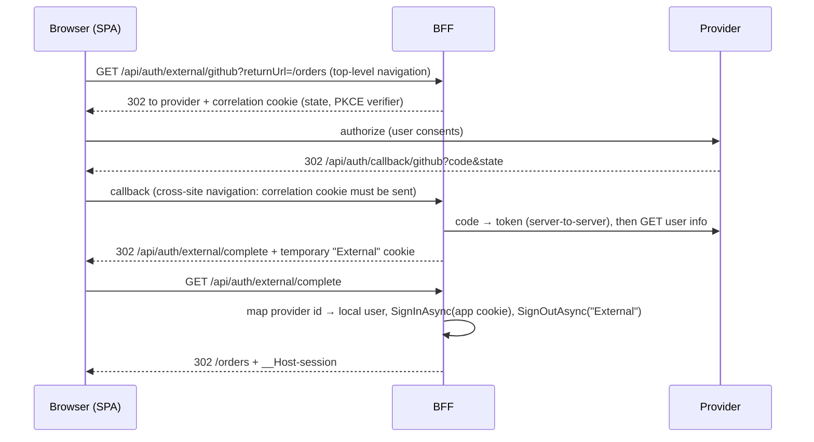

# External login — "Sign in with GitHub/Discord/Google/Entra ID"

Verified against official documentation, October 2026 (learn.microsoft.com: social sign-in without Identity, SameSite cookies, `RemoteAuthenticationOptions`/`OAuthOptions` API, cookie authentication). Extends `SKILL.md`.

**Stance:** the BFF is an OAuth/OIDC **client** of someone else's identity provider. We still run no identity provider of our own, and nothing the provider issues reaches the browser: the provider's tokens stay server-side, the browser only ever gets our own `__Host-session` cookie.

## Flow



## Wiring

```csharp
builder.Services.AddAuthentication(CookieAuthenticationDefaults.AuthenticationScheme)
    .AddCookie(o => { /* the app session cookie from SKILL.md — __Host-session, SameSite=Strict */ })
    .AddCookie(ExternalScheme.Name, o =>
    {
        o.Cookie.Name = "__Host-external";
        o.Cookie.HttpOnly = true;
        o.Cookie.SecurePolicy = CookieSecurePolicy.Always;
        o.Cookie.SameSite = SameSiteMode.Lax;   // written and read inside the provider's cross-site redirect
        o.ExpireTimeSpan = TimeSpan.FromMinutes(5);   // chain — a Strict cookie wouldn't be sent to /complete
    })
    .AddOAuth("GitHub", o =>
    {
        o.SignInScheme = ExternalScheme.Name;   // NOT the app cookie: the provider identity is only an input
        o.ClientId = builder.Configuration["Auth:GitHub:ClientId"]!;
        o.ClientSecret = builder.Configuration["Auth:GitHub:ClientSecret"]!;   // a secret: configuration-secrets
        o.CallbackPath = "/api/auth/callback/github";   // handled by the auth middleware; register it at the provider
        o.AuthorizationEndpoint = "https://github.com/login/oauth/authorize";
        o.TokenEndpoint = "https://github.com/login/oauth/access_token";
        o.UserInformationEndpoint = "https://api.github.com/user";
        o.UsePkce = true;                       // where the provider supports PKCE
        o.Scope.Add("read:user");
        o.SaveTokens = false;                   // the default — never put provider tokens in a cookie
        o.ClaimActions.MapJsonKey(ClaimTypes.NameIdentifier, "id");
        o.ClaimActions.MapJsonKey(ClaimTypes.Name, "login");
        o.Events.OnCreatingTicket = async ctx =>
        {
            using var request = new HttpRequestMessage(HttpMethod.Get, ctx.Options.UserInformationEndpoint);
            request.Headers.Authorization = new AuthenticationHeaderValue("Bearer", ctx.AccessToken);
            request.Headers.UserAgent.ParseAdd("app-bff");   // GitHub's API rejects requests without one
            using var response = await ctx.Backchannel.SendAsync(request, ctx.HttpContext.RequestAborted);
            response.EnsureSuccessStatusCode();
            using var user = await JsonDocument.ParseAsync(
                await response.Content.ReadAsStreamAsync(ctx.HttpContext.RequestAborted),
                cancellationToken: ctx.HttpContext.RequestAborted);
            ctx.RunClaimActions(user.RootElement);
            // Only if the app must call the provider later: store ctx.AccessToken / ctx.RefreshToken
            // server-side here (DB row per user+provider, encrypted with IDataProtector) — never SaveTokens.
        };
    });

public static class ExternalScheme { public const string Name = "External"; }
```

- Prefer a maintained handler over raw `AddOAuth` when one exists: Microsoft ships `AddGoogle`, `AddMicrosoftAccount`, `AddFacebook`, `AddTwitter`; the community `AspNet.Security.OAuth.Providers` packages cover GitHub, Discord and many more (`AddGitHub`, `AddDiscord`) with the endpoints and claim mappings above built in. Enterprise login (Entra ID, Keycloak, any OIDC IdP) = `AddOpenIdConnect` as a client with the same `SignInScheme = External` pattern.
- **Correlation/nonce cookies:** `RemoteAuthenticationOptions.CorrelationCookie` (and OIDC's `NonceCookie`) default to `SameSite=None` + `Secure` because the callback is a **cross-site** request from the provider. Never set them to `Strict` — the browser drops them on the callback and every login fails with "Correlation failed". `Lax` works only for GET callbacks (classic OAuth code flow); providers that use `response_mode=form_post` (OIDC, Apple) POST the callback and need the default `None`.
- `UsePkce = true` on OAuth handlers whose provider supports PKCE (the OIDC handler enables it by default); the `state` is data-protected, so the key ring must be shared across instances (SKILL.md → Data protection).

## Endpoints

```csharp
// api = the antiforgery-filtered app.MapGroup("/api") from SKILL.md (CSRF section); GETs skip validation
var auth = api.MapGroup("/auth").RequireRateLimiting("auth"); // the one /api/auth group (best-practices.md → Rate limiting)

// Route segment (lowercase, matches CallbackPath) → registered scheme name. Doubles as the allow-list:
// scheme names are case-sensitive, so "/external/github" must never reach Challenge as "github".
var externalSchemes = new Dictionary<string, string>(StringComparer.OrdinalIgnoreCase)
{
    ["github"] = "GitHub",
};

auth.MapGet("/external/{provider}", Results<ChallengeHttpResult, NotFound> (
    string provider, string? returnUrl) =>
{
    if (!externalSchemes.TryGetValue(provider, out var scheme)) return TypedResults.NotFound();
    var props = new AuthenticationProperties
    {
        RedirectUri = $"/api/auth/external/complete?returnUrl={Uri.EscapeDataString(LocalOrRoot(returnUrl))}",
        Items = { ["provider"] = scheme },                                  // round-trips data-protected in `state`
    };
    return TypedResults.Challenge(props, [scheme]);
}).AllowAnonymous();

auth.MapGet("/external/complete", async Task<RedirectHttpResult> (
    string? returnUrl, HttpContext http, IExternalLoginService logins, CancellationToken ct) =>
{
    var result = await http.AuthenticateAsync(ExternalScheme.Name);
    if (!result.Succeeded || result.Properties is null
        || !result.Properties.Items.TryGetValue("provider", out var provider) || provider is null
        || result.Principal?.FindFirstValue(ClaimTypes.NameIdentifier) is not { } providerKey)
    {
        await http.SignOutAsync(ExternalScheme.Name);                       // drop a broken/expired temp cookie
        return TypedResults.LocalRedirect("/login?error=external");
    }

    var user = await logins.FindByLoginAsync(provider, providerKey, ct);   // (provider, key) — never by e-mail
    if (user is null)                                                       // keep the External cookie: the
        return TypedResults.LocalRedirect("/signup/external");             // sign-up POST still reads it

    var principal = logins.CreatePrincipal(user);                           // incl. security_stamp claim
    await http.SignInAsync(CookieAuthenticationDefaults.AuthenticationScheme, principal);
    await http.SignOutAsync(ExternalScheme.Name);                           // one-shot: consumed only on success
    http.User = principal;                                                  // XSRF token for the new identity
    return TypedResults.LocalRedirect(LocalOrRoot(returnUrl));
}).AllowAnonymous();

static string LocalOrRoot(string? url) =>
    url is { Length: > 0 } && url[0] == '/' && !url.StartsWith("//") && !url.StartsWith("/\\") ? url : "/";
```

The SPA starts the flow with a **top-level navigation** (`window.location.href = '/api/auth/external/github?returnUrl=…'`), never `HttpClient` — an XHR can't follow a redirect to the provider's login page.

For the sign-up branch, the SPA posts the remaining profile fields (antiforgery-validated) to an endpoint that reads `AuthenticateAsync(ExternalScheme.Name)` again — that is why `/complete` signs the External cookie out only on the success path. The sign-up (and account-linking) POST handler calls `SignOutAsync(ExternalScheme.Name)` itself once it has committed; until then the cookie's 5-minute lifetime is the window.

## Account linking

- Store links as `user_logins (provider, provider_key, user_id)` with a **unique constraint on `(provider, provider_key)`**; one user can have many logins.
- **Never auto-link by e-mail.** An unverified (or provider-recycled) e-mail address matching an existing account is an account takeover. Linking happens only while the user is already signed in to the local account.
- Linking a provider to the *current* account is a **separate flow** — the sign-in endpoints above (`AllowAnonymous` challenge, `/complete`) never link. The canonical pattern is `discord` → `references/app-integration.md` §6 (provider-agnostic): an **authenticated** start GET whose challenge records the current user id in `props.Items["link:user"]` (it round-trips tamper-proof in `state`), a callback that redirects to an SPA confirm page and keeps the External cookie, and an **antiforgery-validated POST** that checks the External cookie's `link:user` against the signed-in user before persisting the link. Don't rely on reading `__Host-session` inside the provider's redirect chain — it is `SameSite=Strict`. A forced GET must never be enough to attach someone else's provider identity.
- Unlinking must leave at least one way to sign in (another login or a password).

## Anti-patterns

| Anti-pattern | Fix |
|---|---|
| `SaveTokens = true` "in case we need it" | Tokens in the session cookie (size, replay surface) — store server-side in `OnCreatingTicket` only if actually needed |
| `SignInScheme` = the app cookie | The provider identity becomes the session as-is; sign into a temporary External scheme, map to a local user, then issue the app cookie |
| Correlation cookie `SameSite=Strict` | "Correlation failed" on every callback — leave the default `None`+`Secure` (or `Lax` for GET-only callbacks) |
| Matching provider identity to users by e-mail | `(provider, provider_key)` lookup; link only from an authenticated session |
| Unvalidated `returnUrl` | Open redirect — accept local paths only (`LocalRedirect` throws on non-local URLs) |
| Starting the flow with `HttpClient` from Angular | Top-level navigation |

## Sources

- https://learn.microsoft.com/en-us/aspnet/core/security/authentication/social/social-without-identity?view=aspnetcore-10.0
- https://learn.microsoft.com/en-us/aspnet/core/security/authentication/social/other-logins?view=aspnetcore-10.0
- https://learn.microsoft.com/en-us/aspnet/core/security/samesite?view=aspnetcore-10.0 (CorrelationCookie / NonceCookie default `None`)
- https://learn.microsoft.com/en-us/dotnet/api/microsoft.aspnetcore.authentication.oauth.oauthoptions
- https://learn.microsoft.com/en-us/dotnet/api/microsoft.aspnetcore.authentication.remoteauthenticationoptions.savetokens
- https://github.com/aspnet-contrib/AspNet.Security.OAuth.Providers
- https://docs.github.com/en/rest/using-the-rest-api/getting-started-with-the-rest-api#user-agent
