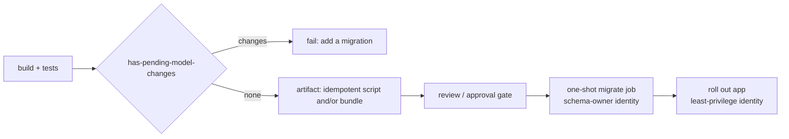

# EF Core migrations in CI/CD

Verified against official documentation, October 2026 (learn.microsoft.com: EF Core "Applying Migrations" incl. bundles/containers and migration locking, "Managing Migrations" → pending model changes, "Migrations in Team Environments" → review and gate scripts, EF 9 breaking changes, `dotnet ef` CLI reference). Extends `SKILL.md` → Migrations. The `/noobit:ef-migration` command walks the authoring side (add → script → destructive-op review → integration tests). Pipeline YAML (Azure DevOps): `noobit:ci-pipelines`.

## Pipeline shape



1. **Gate — model and migrations agree.** `dotnet ef migrations has-pending-model-changes --project src/App.Infrastructure --startup-project src/App.Api` fails the build when someone changed the model without adding a migration (EF 8+). Since EF 9, `Migrate()`/`database update`/bundles **throw** on pending model changes anyway (`PendingModelChangesWarning`) — catch it in CI, not at deploy. Programmatic equivalent for a unit test: `db.Database.HasPendingModelChanges()`.
2. **Build the artifact once**, from the same commit as the app image:
   - `dotnet ef migrations script --idempotent -o artifacts/migrate.sql` — the docs' recommendation for production: reviewable, the exact SQL that a reviewer approves is the SQL that runs. Idempotent scripts check the history table, so they work against databases at different versions. **SQLite can't generate idempotent scripts** — generate a versioned `from → to` script instead.
   - or `dotnet ef migrations bundle --self-contained -r linux-x64 -o artifacts/efbundle` — a single executable, no SDK/source on the target; covered by EF's migration lock (scripts are not). Without `--connection` it uses the application's configured connection string — the canonical compose job below feeds it from a secret file, keeping it out of argv; don't ship production secrets in an `appsettings.json` next to it.
   - Also generate the **rollback** script (`dotnet ef migrations script <current> <previous>`) and store it beside the forward one — it runs the `Down` operations and can't restore data a forward step dropped.
3. **Review** destructive operations (drop/rename column, type narrowing, new NOT NULL without default) before approval — gate the deploy stage on it.
4. **Apply before the rollout, as a separate one-shot step**, with a dedicated **schema-owner** database identity (DDL rights). The application runs with a least-privilege identity (DML only) — it never needs `ALTER`/`CREATE`.
5. **Then roll out the app.** Old and new app versions overlap during a rolling deploy, so every migration must be compatible with the previous app version: **expand → migrate → contract** (add the new column/table, deploy code that writes both/reads new, backfill, remove the old in a later release). Renames are add + copy + drop across releases, never a single `RenameColumn` under live traffic.

## Never `Migrate()` at startup in multi-replica production

The docs call runtime migration inappropriate for production and, for containers, say explicitly: generate the bundle during the build and run it as a one-shot deployment job after the database is healthy — don't make every application replica run migrations from its entrypoint. EF 9's database-wide migration lock only removes the corruption race; the other objections remain (the app would need DDL permissions, uninspected SQL, awkward rollback, N replicas contending at boot). Single-instance dev/test: startup `MigrateAsync()` is fine.

## Compose deployment (single host) — the canonical `migrate` job

This is the one `migrate` service shape for the stack; `docker` (compose skeleton) and `ci-pipelines` (deploy + e2e) reference it instead of redefining it.

```yaml
services:
  migrate:                                    # one-shot job — never part of a plain `up`
    image: ${REGISTRY}/app:${APP_TAG}         # the app image: same runtime base (ICU, OpenSSL), same tag
    profiles: [tools]                         # runs only via `docker compose run --rm migrate`
    entrypoint: ["/migrations/efbundle"]      # no --connection: the bundle reads the app's configuration
    working_dir: /app                         # config files resolve from here → the image's appsettings*.json
    environment:
      ASPNETCORE_ENVIRONMENT: Production      # never let the bundle fall back to Development (user secrets)
    secrets:                                  # schema-owner (DDL) identity, under the app's config key
      - { source: db_schema_owner, target: ConnectionStrings__Default }
    volumes: ["./migrations:/migrations:ro"]  # self-contained linux-x64 bundle shipped by the pipeline (chmod +x)
    cap_drop: [ALL]
    security_opt: ["no-new-privileges:true"]
    depends_on:
      db: { condition: service_healthy }
    networks: [backend]                       # needs only the database
    restart: "no"                             # never restart a finished migration job
    logging: { driver: local }

secrets:
  db_schema_owner: { file: ./secrets/db_schema_owner }   # Host=db;Database=app;Username=app_owner;Password=…
```

**How the connection string gets in.** `efbundle` without `--connection` uses "the database connection string from your application's configuration" (EF docs) — it builds the startup project's host, so the app's own `builder.Configuration.AddKeyPerFile("/run/secrets", optional: true)` (`docker` skill) reads `/run/secrets/ConnectionStrings__Default`. The `migrate` container mounts the **schema-owner** string there; the `app` container mounts the **DML-only** string under the same name (`db_connection`). Requirements: the `DbContext` is registered from `builder.Configuration.GetConnectionString("Default")` in `Program.cs` (not a design-time factory with its own config), and nothing before `builder.Build()` needs config the job doesn't have (`ValidateOnStart` runs only when the host starts, so it doesn't interfere).

Why not `--connection "$(cat /run/secrets/…)"` in a `sh -c` entrypoint: the string then sits in the bundle's argv for the whole run — readable by **any user on the host** via `ps` (containers share the host's process table), not just inside the container. Passing `${MIGRATION_DB_CONNECTION}` from `.env` is worse: it also lands in the container config (`docker inspect`) and gets `$`-mangled by compose interpolation. With the secret file the credential never appears in argv, env or `docker inspect`. `.env` holds non-secrets only (`REGISTRY`, `APP_TAG`, `COMPOSE_PROFILES`).

Running it — before the app is switched, so a failure stops the deploy (`ci-pipelines` → deploy step):

```bash
APP_TAG=<new> docker compose run --rm migrate   # starts db if needed; exits non-zero on failure; removes the container
```

- Not `depends_on: { migrate: { condition: service_completed_successfully } }` on `app`: that re-runs the job on every `up` and couples app restarts to the migration. The deploy runs it once, explicitly.
- The schema-owner (DDL) and app (DML) database roles are created once by the database's init script: `docker` → references/best-practices.md → *Database roles*.
- The bundle is self-contained, so the app image only provides OS libraries: fine on `aspnet` (ICU included); on plain `-chiseled` (no ICU) publish with `InvariantGlobalization` or use `-chiseled-extra`. No shell needed — the entrypoint is exec-form.
- e2e stacks run the same job with `ASPNETCORE_ENVIRONMENT=E2E`, so `UseSeeding` can create the e2e user (bundles run seeding): `ci-pipelines` → references/azure-pipelines.md → *Running e2e in the pipeline*.

## Anti-patterns

| Anti-pattern | Fix |
|---|---|
| `Database.MigrateAsync()` in `Program.cs` for production | One-shot bundle/script step before the rollout |
| Regenerating SQL at deploy time | Deploy the reviewed artifact from the build |
| App connection string with DDL rights | Separate schema-owner identity for migrations only |
| Migration connection string as `--connection` argv or a `.env` value | Secret file under the app's config key (`ConnectionStrings__Default`) in the `migrate` job — never argv/env |
| Destructive change in the same release as the code that stops using the column | Expand → contract across releases |
| No `has-pending-model-changes` gate | First symptom is a deploy that throws `PendingModelChangesWarning` |
| `EnsureCreated()` anywhere near migrations | Migrations only — `EnsureCreated` bypasses the history table |

## Sources

- https://learn.microsoft.com/en-us/ef/core/managing-schemas/migrations/applying (scripts, bundles, containers and deployment jobs, migration locking)
- https://learn.microsoft.com/en-us/ef/core/managing-schemas/migrations/managing#checking-for-pending-model-changes
- https://learn.microsoft.com/en-us/ef/core/managing-schemas/migrations/teams#review-and-gate-migration-scripts
- https://learn.microsoft.com/en-us/ef/core/what-is-new/ef-core-9.0/breaking-changes#pending-model-changes
- https://learn.microsoft.com/en-us/ef/core/cli/dotnet
- https://docs.docker.com/reference/compose-file/services/#depends_on
