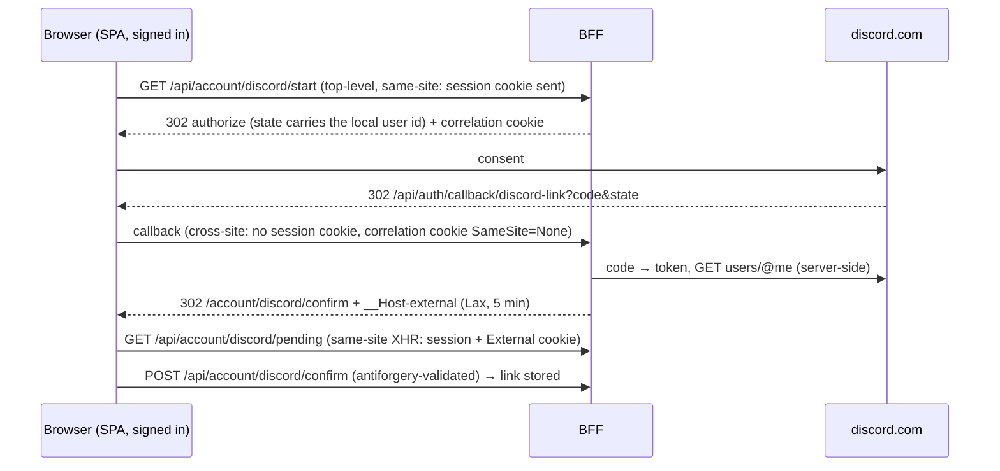

# Integrating your application with Discord

Your web app or worker doing things *in* Discord (posting, editing, roles), and Discord telling your app
things (installs, purchases, account links). Code targets Discord.Net 3.20.1; tests in [testing.md](testing.md).

Code blocks omit `using` directives (add the System.*, Discord.*, Microsoft.Extensions.* and `MyApp.*` namespaces the
types come from); the file-scoped namespace shows which project a file belongs to.

**Contents:** 1 Outbound: queue + publisher via `IDiscordClient` · 2 Post-then-edit (live status messages) · 3
REST-only client in a web app · 4 Channel webhooks (no bot) · 5 Webhook Events (installs, entitlements) · 6 OAuth2
account linking · 7 Linked Roles, monetization · 8 Idempotency & durability

## 1. Outbound: queue + publisher

Application code never calls Discord inline (no awaiting Discord inside HTTP requests, domain-event
handlers or `SaveChanges`): latency, rate limits and outages would leak into your app. Enqueue and return.

`Announcement.cs`

```csharp
namespace MyApp.Discord.Announcements;

public sealed record Announcement(Guid Id, string Title, string Body, string? ImageUrl = null, string? LinkUrl = null);
```

`AnnouncementQueue.cs`

```csharp
namespace MyApp.Discord.Announcements;

/// <summary>
/// In-process hand-off from application code (endpoints, domain-event handlers) to the Discord publisher.
/// Never call Discord from inside a request or SaveChanges — enqueue and return.
/// </summary>
public interface IAnnouncementQueue
{
    /// <returns><c>false</c> when the queue is full — the caller logs it, it never blocks or throws.</returns>
    bool TryEnqueue(Announcement announcement);
}

public sealed class AnnouncementQueue : IAnnouncementQueue
{
    // FullMode.Wait + TryWrite ⇒ TryWrite returns false when full (DropWrite would report true and drop silently).
    private readonly Channel<Announcement> _channel = Channel.CreateBounded<Announcement>(
        new BoundedChannelOptions(100) { FullMode = BoundedChannelFullMode.Wait, SingleReader = true });

    public bool TryEnqueue(Announcement announcement) => _channel.Writer.TryWrite(announcement);

    public IAsyncEnumerable<Announcement> ReadAllAsync(CancellationToken ct) => _channel.Reader.ReadAllAsync(ct);
}
```

`AnnouncementPublisher.cs`

```csharp
namespace MyApp.Discord.Announcements;

/// <summary>
/// Drains <see cref="AnnouncementQueue"/> and posts to Discord through <see cref="IDiscordClient"/> — works with
/// the gateway client (bot process) and with a logged-in <c>DiscordRestClient</c> (web app, no gateway) alike.
/// </summary>
public sealed class AnnouncementPublisher(
    AnnouncementQueue queue,
    IDiscordClient discord,
    IOptions<DiscordOptions> options,
    ILogger<AnnouncementPublisher> logger) : BackgroundService
{
    protected override async Task ExecuteAsync(CancellationToken stoppingToken)
    {
        if (options.Value.AnnouncementChannelId is not { } channelId)
        {
            logger.LogInformation("Discord announcements disabled: no AnnouncementChannelId configured");
            return;
        }

        await foreach (var announcement in queue.ReadAllAsync(stoppingToken))
        {
            try
            {
                var messageId = await PublishAsync(channelId, announcement, stoppingToken);
                logger.LogInformation("Posted announcement {AnnouncementId} as message {MessageId}", announcement.Id, messageId);
            }
            catch (HttpException ex) when (ex.HttpCode is System.Net.HttpStatusCode.Forbidden or System.Net.HttpStatusCode.NotFound)
            {
                // 50001 Missing Access / 50013 Missing Permissions / 10003 Unknown Channel: config problem, retrying won't help.
                // 401/403/429 responses count toward Cloudflare's 10k-invalid-requests-per-10-min IP ban (404 doesn't).
                logger.LogError(ex, "Announcement {AnnouncementId} rejected by Discord ({DiscordCode}); check channel id and bot permissions",
                    announcement.Id, ex.DiscordCode);
            }
            catch (Exception ex) when (ex is not OperationCanceledException)
            {
                // Discord.Net already retried rate limits, timeouts and 502s (RetryMode.AlwaysRetry). If losing an
                // announcement is unacceptable, persist it (outbox) before enqueueing and mark it sent here.
                logger.LogError(ex, "Failed to post announcement {AnnouncementId}", announcement.Id);
            }
        }
    }

    public async Task<ulong> PublishAsync(ulong channelId, Announcement announcement, CancellationToken ct)
    {
        var requestOptions = new RequestOptions { CancelToken = ct };
        if (await discord.GetChannelAsync(channelId, CacheMode.AllowDownload, requestOptions) is not IMessageChannel channel)
        {
            throw new InvalidOperationException($"Channel {channelId} is not a message channel the bot can see");
        }

        var message = await channel.SendMessageAsync(
            components: AnnouncementCard.Build(announcement),
            flags: MessageFlags.ComponentsV2,               // explicit: not every send path auto-detects V2
            allowedMentions: AllowedMentions.None,          // app content must never ping @everyone by accident
            options: requestOptions);
        return message.Id;
    }
}
```

Both DI extensions (gateway-bot.md §3, http-interactions.md §2) register the queue, its interface and the
publisher.

- `IDiscordClient` is the `DiscordSocketClient` in a bot process and a logged-in `DiscordRestClient` in a web
  app — the publisher doesn't care. `GetChannelAsync(id, CacheMode.AllowDownload)` falls back to REST before
  the gateway cache is ready.
- In-process `Channel<T>` loses queued items on restart. When a message **must** arrive (billing events,
  moderation logs), write an outbox row in the same transaction as the business change and let the publisher
  drain the outbox (see `noobit:rabbitmq-messaging` for the outbox pattern; RabbitMQ when another service
  owns the Discord integration).
- **Multiple replicas each run this publisher.** An in-process queue is fine (each replica posts what *it*
  enqueued), but an outbox drained by every replica double-posts unless rows are claimed: `FOR UPDATE SKIP
  LOCKED` (`noobit:postgres`) / `UPDLOCK, READPAST` (`noobit:mssql`), marking the row sent inside the claiming
  transaction — the rule in `noobit:rabbitmq-messaging` ("Multiple publisher instances must claim rows").
  Store the returned message id with the row so a retry edits instead of re-posting.
- Microservices: the service owning the Discord token consumes domain events from RabbitMQ and is the only
  one talking to Discord — other services never hold the bot token.

## 2. Post-then-edit (live status messages)

For "deployment running → finished", "stream live → ended", "ticket open → closed": post once, store the
message id with your entity, edit later instead of posting again.

```csharp
// sketch — StatusCard and job are your types; the Discord.Net calls are the real API
var message = await channel.SendMessageAsync(components: StatusCard.Running(job), flags: MessageFlags.ComponentsV2,
    allowedMentions: AllowedMentions.None);
job.SetDiscordMessage(channel.Id, message.Id);              // persist both ids (snowflakes: ulong / string(20))
// later
await channel.ModifyMessageAsync(job.DiscordMessageId, m => m.Components = StatusCard.Finished(job));
```

Handle `HttpException` with `DiscordCode == DiscordErrorCode.UnknownMessage` (someone deleted it): post a new
one or give up, don't retry.

## 3. REST-only client in a web app

No gateway needed to post or manage things: one `DiscordRestClient` singleton (it owns the rate-limit buckets —
never `new DiscordRestClient()` per request), also registered as `IDiscordClient`, logged in at startup. This
process **receives no interactions**: no modules, no `PublicKey`, no Webhook Events inbox — so don't reuse
`DiscordHttpExtensions`/`DiscordHttpStartup` (http-interactions.md) for it.

**Only ONE process per application registers commands** — the one that owns the interaction modules (the
gateway worker, or the HTTP-interactions host). `Register*Async` is a bulk overwrite: any other process that
calls it replaces the command list with its own (none here) — in the usual layout (gateway worker + REST-only
web API on the same application) every API deploy would delete the bot's global commands. Set
`Discord:RegisterCommands=false` on any further module-owning process (gateway-bot.md §2).

`DiscordRestExtensions.cs`

```csharp
namespace MyApp.Discord;

public static class DiscordRestExtensions
{
    /// <summary>REST-only Discord client for a web API or worker that posts/edits but receives no interactions.</summary>
    public static IServiceCollection AddDiscordRest(this IServiceCollection services)
    {
        services.AddOptions<DiscordOptions>()
            .BindConfiguration(DiscordOptions.SectionName)
            .Validate(o => !string.IsNullOrWhiteSpace(o.Token), "Discord:Token is required for the REST client")
            .ValidateOnStart();
        services.AddSingleton<IValidateOptions<DiscordOptions>, DiscordOptionsValidator>(); // gateway-bot.md §2

        services.AddSingleton(_ => new DiscordRestClient(new DiscordRestConfig { LogLevel = LogSeverity.Info }));
        services.AddSingleton<IDiscordClient>(sp => sp.GetRequiredService<DiscordRestClient>());
        services.AddHostedService<DiscordRestStartup>();
        return services;
    }
}

/// <summary>
/// Logs the REST client in and checks the token. Owns no modules and never calls <c>Register*Async</c> — command
/// registration belongs to the one process that owns the modules.
/// </summary>
public sealed class DiscordRestStartup(
    DiscordRestClient rest,
    IOptions<DiscordOptions> options,
    ILogger<DiscordRestStartup> logger) : IHostedService
{
    public async Task StartAsync(CancellationToken cancellationToken)
    {
        rest.Log += message => DiscordLog.Write(logger, message);

        // REST LoginAsync calls users/@me (401 fails startup) but takes no cancel token, and RetryMode.AlwaysRetry
        // retries 502s — WaitAsync keeps a Discord outage from hanging startup.
        await rest.LoginAsync(TokenType.Bot, options.Value.Token).WaitAsync(cancellationToken);
        var application = await rest.GetApplicationInfoAsync(new RequestOptions { CancelToken = cancellationToken });

        // A token copied from another app (e.g. the staging bot) logs in fine — catch it here, not in production posts.
        if (options.Value.ClientId.Length > 0
            && options.Value.ClientId != application.Id.ToString(CultureInfo.InvariantCulture))
        {
            throw new InvalidOperationException(
                $"Discord:Token belongs to application {application.Id}, not Discord:ClientId {options.Value.ClientId}");
        }

        logger.LogInformation("Discord REST client logged in for application {ApplicationId}", application.Id);
    }

    public Task StopAsync(CancellationToken cancellationToken) => rest.LogoutAsync();
}
```

## 4. Channel webhooks (no bot)

`WebhookAnnouncer.cs`

```csharp
namespace MyApp.Discord.Announcements;

/// <summary>
/// Simplest outbound path: post through a channel webhook URL (Channel settings → Integrations → Webhooks).
/// No bot, no token, no gateway — but webhooks the app doesn't own cannot carry interactive components,
/// so this card variant has link buttons only. Call it from a background publisher, not from request code.
/// </summary>
public sealed class WebhookAnnouncer : IAsyncDisposable
{
    private readonly Func<DiscordWebhookClient> _createClient;
    private readonly SemaphoreSlim _gate = new(1, 1);
    private DiscordWebhookClient? _client;

    public WebhookAnnouncer(string webhookUrl) : this(() => new DiscordWebhookClient(webhookUrl)) { }

    /// <param name="createClient">Client factory — the seam tests use to simulate a failing construction.</param>
    public WebhookAnnouncer(Func<DiscordWebhookClient> createClient) => _createClient = createClient;

    public async Task<ulong> PostAsync(Announcement a, CancellationToken ct)
    {
        var client = await GetClientAsync(ct);
        return await client.SendMessageAsync(
            components: AnnouncementCard.BuildStatic(a),
            flags: MessageFlags.ComponentsV2,
            allowedMentions: AllowedMentions.None,
            username: "MyApp",
            options: new RequestOptions { CancelToken = ct });
    }

    // DiscordWebhookClient's constructor performs blocking HTTP calls (login + GET webhook) and throws for an
    // unknown/deleted webhook or during an outage — never construct it in DI/startup or on a request thread.
    // Build it off-thread on first use and cache only a SUCCESS: a cached failure (Lazy<Task<T>>) would stop all
    // alerts until the process restarts.
    private async Task<DiscordWebhookClient> GetClientAsync(CancellationToken ct)
    {
        if (Volatile.Read(ref _client) is { } existing)
        {
            return existing;
        }

        await _gate.WaitAsync(ct);
        try
        {
            if (_client is null)
            {
                var created = await Task.Run(_createClient, ct); // throws → nothing cached, the next post retries
                Volatile.Write(ref _client, created);
            }

            return _client!;
        }
        finally
        {
            _gate.Release();
        }
    }

    public ValueTask DisposeAsync()
    {
        _client?.Dispose();
        _gate.Dispose();
        return ValueTask.CompletedTask;
    }
}
```

- **`DiscordWebhookClient`'s constructor makes blocking HTTP calls** (login + fetch webhook) and throws for an
  unknown or deleted webhook. Never construct it in DI registration, startup, or on a request thread — create it
  off-thread on first use, and **don't cache a failed construction** (as above), or one Discord blip silences
  every later alert.
- **Raw-HTTP alternative** (no Discord.Net.Webhook dependency): `POST {webhookUrl}?with_components=true` via a
  typed `IHttpClientFactory` client with source-generated System.Text.Json. Without `with_components=true`
  Discord **ignores the `components` field** on webhooks the app doesn't own (Discord.Net adds the parameter
  for you). Send `"flags": 32768` (IS_COMPONENTS_V2) and `"allowed_mentions": {"parse": []}`; retries/429s are
  then yours (`AddStandardResilienceHandler`, honour `Retry-After`).
- Webhook URL = secret (anyone with it can post). Store like a token; keep it out of logs (HttpClient logging
  prints request URLs).
- Webhooks not created by your application can't send interactive components (link buttons are fine).
  Webhooks created *by* the app (`channel.CreateWebhookAsync` with the bot) can.
- Stop using a webhook after a 404 (deleted) — Discord asks you to; 401/403/429 responses count toward the
  invalid-request ban.

## 5. Webhook Events

Discord → your app over HTTP: `APPLICATION_AUTHORIZED` (someone installed the app — guild or **user** install)
and `APPLICATION_DEAUTHORIZED` exist **only** here; `ENTITLEMENT_CREATE/UPDATE/DELETE` arrive here *and* as
gateway events (shard 0) — HTTP-only apps use this endpoint for them.
Configure Portal → Webhooks → Endpoint URL + event types.

`DiscordWebhookEventsEndpoint.cs`

```csharp
namespace MyApp.Interactions;

/// <summary>Discord "Webhook Events": verify like interactions, store raw, answer 204 — contract below.</summary>
public static class DiscordWebhookEventsEndpoint
{
    private const int MaxBodyBytes = 256 * 1024; // events are a few KB; cap what unauthenticated callers can make us buffer

    public static IEndpointConventionBuilder MapDiscordWebhookEvents(this IEndpointRouteBuilder app, string pattern) =>
        app.MapPost(pattern, HandleAsync)
            .AllowAnonymous()       // signature verification is the auth; the BFF fallback policy would 401 Discord's PING
            .DisableAntiforgery()
            .ExcludeFromDescription();

    private static async Task HandleAsync(HttpContext http)
    {
        // Everything here finishes inside the request → RequestServices (the inbox is a scoped DbContext).
        var services = http.RequestServices;
        var publicKey = services.GetRequiredService<IOptions<DiscordOptions>>().Value.PublicKey;
        var inbox = services.GetRequiredService<IWebhookEventInbox>();

        var signature = http.Request.Headers["X-Signature-Ed25519"].ToString();
        var timestamp = http.Request.Headers["X-Signature-Timestamp"].ToString();
        var body = await DiscordSignedRequest.ReadBodyAsync(http.Request, MaxBodyBytes, http.RequestAborted);
        if (body is null)
        {
            http.Response.StatusCode = StatusCodes.Status413PayloadTooLarge;
            return;
        }

        // No freshness check here (see below) — the dedupe key makes replays harmless instead.
        if (!DiscordSignedRequest.IsValidSignature(publicKey, signature, timestamp, body))
        {
            http.Response.StatusCode = StatusCodes.Status401Unauthorized;
            return;
        }

        var (isPing, eventType) = Peek(body);
        if (!isPing)
        {
            // Raw bytes to a durable inbox — even unexpected JSON; a background job interprets them.
            var dedupeKey = Convert.ToHexString(System.Security.Cryptography.SHA256.HashData(body));
            await inbox.StoreAsync(eventType, dedupeKey, body, http.RequestAborted);
        }

        http.Response.StatusCode = StatusCodes.Status204NoContent;
        http.Response.ContentType = "application/json"; // Discord requires a valid Content-Type even on the empty 204
    }

    private static (bool IsPing, string EventType) Peek(byte[] body)
    {
        try
        {
            using var doc = JsonDocument.Parse(body);
            var root = doc.RootElement;
            if (root.ValueKind != JsonValueKind.Object)
            {
                return (false, "UNPARSEABLE");
            }

            // TryGetInt32: GetInt32 throws FormatException (not JsonException) on 0.5 / 1e99 → would be a 500
            var isPing = root.TryGetProperty("type", out var type) && type.ValueKind == JsonValueKind.Number
                         && type.TryGetInt32(out var typeValue) && typeValue == 0;
            var eventType = root.TryGetProperty("event", out var evt) && evt.ValueKind == JsonValueKind.Object
                            && evt.TryGetProperty("type", out var t) && t.ValueKind == JsonValueKind.String
                ? t.GetString()!
                : "UNKNOWN";
            return (isPing, eventType);
        }
        catch (JsonException)
        {
            return (false, "UNPARSEABLE"); // signed by Discord but not JSON we understand — keep it for inspection
        }
    }
}

/// <summary>Implement as a DB table (EF Core, scoped) with a unique index on the dedupe key.</summary>
public interface IWebhookEventInbox
{
    /// <param name="dedupeKey">Hash of the raw body — retries of the same delivery are identical.</param>
    /// <remarks>A unique-key violation means "already stored" → return normally (the endpoint answers 204).
    /// Rethrowing turns every retry into a 500 and keeps Discord retrying.</remarks>
    Task StoreAsync(string eventType, string dedupeKey, byte[] rawBody, CancellationToken ct);
}

// EF Core sketch — plain INSERT, catch the duplicate (race-free; "check, then insert" isn't):
//   db.DiscordWebhookEvents.Add(new DiscordWebhookEvent { EventType = eventType, DedupeKey = dedupeKey, Body = rawBody, ... });
//   try { await db.SaveChangesAsync(ct); }
//   catch (DbUpdateException ex) when (IsUniqueViolation(ex)) { }   // retry of a stored delivery → success
// IsUniqueViolation: SqlException 2601/2627 or PostgresException 23505 — the helper in paypal's webhooks.md.
```

**Preconditions — any hosting mode:** `Discord:PublicKey` (the same key that signs interactions) and an
`IWebhookEventInbox` registration. `AddDiscordHttpInteractions` provides both. A gateway-mode web app
(`AddDiscordGateway`: no `DiscordRestClient` registered, `PublicKey` optional) adds them itself — verification
needs no client (`DiscordSignedRequest` brings its own), and an empty key would reject every delivery with 401:

```csharp
// Program.cs of a gateway-mode web app that also maps MapDiscordWebhookEvents
builder.Services.AddDiscordGateway();
builder.Services.AddOptions<DiscordOptions>()
    .Validate(o => o.PublicKey.Length > 0, "Discord:PublicKey is required for Webhook Events")
    .ValidateOnStart();
builder.Services.AddScoped<IWebhookEventInbox, EfWebhookEventInbox>(); // your EF Core inbox
```

Signature verification, body cap, 401/413 and antiforgery are the shared signed-request rules
(http-interactions.md §3); verified **at ingress** (SKILL.md "Stack fit" explains the contrast with
`noobit:paypal`). Differences from the interactions endpoint:
- PING is `type: 0`; PING and events are answered with **204, empty body, but a Content-Type header**.
- No timestamp freshness check: deliveries are retried with backoff for ~10 min when you don't answer within
  3 s and the docs don't promise a fresh timestamp per retry — dedupe instead.
- Deliveries are retried, can arrive out of order and aren't guaranteed — store raw, dedupe, process out of
  band. A duplicate insert is success, not an error: the body was verified at ingress, so (unlike PayPal's
  store-first inbox) a stored row with the same hash is always the genuine delivery. Malformed-but-signed bodies are stored as `UNPARSEABLE` and acknowledged — a 500 would only start
  Discord's retry loop.
- The inbox finishes inside the request → `RequestServices`; resolving a scoped DbContext from the root
  provider throws under `ValidateScopes` or becomes a captive dependency.
- If Discord stops delivering (`event_webhooks_status = 3`, "disabled by Discord", usually for inactivity) it
  emails you — monitor it.

## 6. OAuth2 account linking

Link a Discord user to the signed-in user's account ("Connect Discord" on the profile page). It is the
**account-linking variant of bff-security's external login** ([external-login.md](../../bff-security/references/external-login.md)) —
same temporary `External` cookie, same rules. Why not a hand-rolled `/account/discord/callback`: the callback
arrives in a **cross-site** redirect from discord.com, so the `SameSite=Strict` session cookie isn't sent — the
user (and any `state` kept in the session) is unknown there; under the fallback policy it 401s, otherwise the
link is stored for nobody. And a GET callback must never persist a link on its own.



`DiscordLink.cs`

```csharp
namespace MyApp.Discord.Linking;

/// <summary>"Connect Discord" behind the cookie BFF — bff-security external-login.md, linking variant.</summary>
public static class DiscordLink
{
    public const string Scheme = "DiscordLink";
    public const string StartedBy = "link:user"; // AuthenticationProperties.Items key, round-trips in `state`
    private const string AuthSchemeItem = ".AuthScheme"; // set by ASP.NET Core's RemoteAuthenticationHandler

    /// <summary>Chain after bff-security's AddAuthentication().AddCookie(session).AddCookie(ExternalScheme.Name, …).</summary>
    public static AuthenticationBuilder AddDiscordLink(this AuthenticationBuilder auth)
    {
        // Credentials come from DiscordOptions (gateway-bot.md §2), validated at startup like the rest of it.
        // Binding again is harmless when AddDiscordGateway / AddDiscordHttpInteractions already did.
        auth.Services.AddOptions<DiscordOptions>()
            .BindConfiguration(DiscordOptions.SectionName)
            .Validate(o => o.ClientId.Length > 0 && o.ClientSecret.Length > 0,
                "Discord:ClientId and Discord:ClientSecret are required for account linking")
            .ValidateOnStart();
        auth.Services.TryAddEnumerable(ServiceDescriptor.Singleton<IValidateOptions<DiscordOptions>, DiscordOptionsValidator>());
        auth.Services.AddOptions<OAuthOptions>(Scheme).Configure<IOptions<DiscordOptions>>((o, discord) =>
        {
            o.ClientId = discord.Value.ClientId;
            o.ClientSecret = discord.Value.ClientSecret;        // a secret (SKILL.md rule 15)
        });

        return auth.AddOAuth(Scheme, o =>
        {
            o.SignInScheme = ExternalScheme.Name;               // temporary Lax cookie — never the app session
            // Handled by the authentication middleware, which runs before UseRateLimiter (bff-security order) and
            // short-circuits here — no rate limiter sees it (and no endpoint policy applies). Portal → OAuth2 → Redirects.
            o.CallbackPath = "/api/auth/callback/discord-link";
            o.AuthorizationEndpoint = "https://discord.com/oauth2/authorize";
            o.TokenEndpoint = "https://discord.com/api/oauth2/token";
            o.UserInformationEndpoint = "https://discord.com/api/v10/users/@me";
            o.Scope.Add("identify");                            // + "role_connections.write" for Linked Roles (§7)
            o.SaveTokens = false;                               // the default — tokens never go into a cookie
            o.ClaimActions.MapJsonKey(ClaimTypes.NameIdentifier, "id"); // snowflake, as a string
            o.ClaimActions.MapJsonKey(ClaimTypes.Name, "username");
            o.Events.OnCreatingTicket = async ctx =>
            {
                var ct = ctx.HttpContext.RequestAborted;
                using var request = new HttpRequestMessage(HttpMethod.Get, ctx.Options.UserInformationEndpoint);
                request.Headers.Authorization = new AuthenticationHeaderValue("Bearer", ctx.AccessToken);
                using var response = await ctx.Backchannel.SendAsync(request, ct);
                response.EnsureSuccessStatusCode();
                using var user = await JsonDocument.ParseAsync(await response.Content.ReadAsStreamAsync(ct), cancellationToken: ct);
                ctx.RunClaimActions(user.RootElement);
            };
            o.Events.OnRemoteFailure = ctx =>                   // "Cancel" on Discord's consent screen, expired state, …
            {
                ctx.Response.Redirect("/account/discord/confirm?error=failed");
                ctx.HandleResponse();
                return Task.CompletedTask;
            };
        });
    }

    /// <param name="api">bff-security's antiforgery-filtered <c>/api</c> group (fallback policy = signed in). Deliberately
    /// NOT the <c>/api/auth</c> group: its per-IP <c>auth</c> policy (5/min) is the login brute-force budget, and these
    /// signed-in calls would spend it. They stay on the global per-user limiter.</param>
    public static RouteGroupBuilder MapDiscordLink(this RouteGroupBuilder api)
    {
        var account = api.MapGroup("/account/discord");
        // Start: top-level navigation from the signed-in SPA (same-site → the Strict session cookie is sent; no
        // AllowAnonymous). A GET because Chrome applies the page's `form-action 'self'` to a form POST's redirect
        // to discord.com. Starting changes nothing; a forged cross-site navigation arrives without the session → 401.
        account.MapGet("/start", (ClaimsPrincipal user) => TypedResults.Challenge(
            new AuthenticationProperties
            {
                RedirectUri = "/account/discord/confirm",       // SPA page ("Link Discord account @name?")
                Items = { [StartedBy] = user.FindFirstValue(ClaimTypes.NameIdentifier) }, // data-protected in `state`
            },
            [Scheme]));

        // Confirm page data — same-site XHR, so the session AND the External cookie arrive.
        account.MapGet("/pending", async Task<Results<Ok<PendingDiscordLink>, NotFound>> (HttpContext http) =>
            await ReadPendingAsync(http) is { } pending ? TypedResults.Ok(pending) : TypedResults.NotFound());

        // Commit: a POST under /api → validated by the group's antiforgery filter. A forced GET never links.
        account.MapPost("/confirm", async Task<Results<NoContent, Conflict, BadRequest>> (
            HttpContext http, IDiscordLinkStore links, CancellationToken ct) =>
        {
            if (await ReadPendingAsync(http) is not { } pending) return TypedResults.BadRequest();
            var userId = http.User.FindFirstValue(ClaimTypes.NameIdentifier)!;
            var linked = await links.TryLinkAsync(userId, pending.DiscordUserId, ct);
            await http.SignOutAsync(ExternalScheme.Name);       // one-shot
            return linked ? TypedResults.NoContent() : TypedResults.Conflict(); // Conflict: linked to another account
        });
        return account;
    }

    private static async Task<PendingDiscordLink?> ReadPendingAsync(HttpContext http)
    {
        var result = await http.AuthenticateAsync(ExternalScheme.Name);
        // The External cookie is shared with bff-security's login/sign-up and other provider links: accept only a
        // ticket THIS handler issued (RemoteAuthenticationHandler stamps Items[".AuthScheme"] = scheme name).
        return result.Succeeded
               && result.Properties.Items.TryGetValue(AuthSchemeItem, out var issuedBy) && issuedBy == Scheme
               && result.Properties.Items.TryGetValue(StartedBy, out var startedBy)
               && startedBy == http.User.FindFirstValue(ClaimTypes.NameIdentifier) // committed by whoever started it
               && result.Principal?.FindFirstValue(ClaimTypes.NameIdentifier) is { } discordUserId
            ? new PendingDiscordLink(discordUserId, result.Principal.FindFirstValue(ClaimTypes.Name) ?? discordUserId)
            : null;
    }
}

public sealed record PendingDiscordLink(string DiscordUserId, string DiscordUsername);

/// <summary>Links table with a unique index on the Discord user id (one Discord account → one app user).</summary>
public interface IDiscordLinkStore
{
    /// <returns><c>true</c> when linked (idempotent for the same user); <c>false</c> when the Discord account
    /// already belongs to another user (catch the unique violation — never auto-relink).</returns>
    Task<bool> TryLinkAsync(string userId, string discordUserId, CancellationToken ct);
}
```

Wiring: `builder.Services.AddAuthentication(…).AddCookie(…).AddCookie(ExternalScheme.Name, …).AddDiscordLink()`
and `api.MapDiscordLink()` (`Discord:ClientId` in appsettings, `Discord:ClientSecret` as a secret). The SPA
starts with `window.location.href = '/api/account/discord/start'` (an XHR
can't follow the redirect to discord.com); its confirm page shows `pending.discordUsername`, POSTs through
`HttpClient` (the XSRF interceptor adds the header) and shows `?error=failed` as "linking cancelled".

- The handler does `state`, correlation cookie and the code exchange (server-side, over its `Backchannel` —
  no retry layer, so the single-use code is never replayed). Tokens never reach the browser. The community
  `AspNet.Security.OAuth.Discord` package (`AddDiscord`) is an equivalent alternative to raw `AddOAuth`.
- Store only the Discord user id unless you need ongoing access; then (Linked Roles) store access + refresh
  token **server-side**, encrypted (`IDataProtector`): in `OnCreatingTicket` as a *pending* grant keyed by a
  random id you add as a claim, promoted by the confirm POST — a grant isn't attached to an account before the
  user confirms. Access tokens live 7 days; refresh with `grant_type=refresh_token`.
- Discord.Net's `DiscordRestClient.LoginAsync(TokenType.Bearer, accessToken)` can call user-scoped endpoints
  with typed models — a **short-lived client per user operation** (create, use, dispose), separate from the
  bot's singleton client.

**"Sign in with Discord"** (Discord as the app's login) is out of scope here: it is bff-security's external
login proper. This section only links an already-signed-in user's Discord account.

Scopes: `identify` (id, username, avatar) is enough for linking; `guilds.members.read` to read their member
data in a guild; `role_connections.write` for Linked Roles; `applications.commands` to install the app.

## 7. Linked Roles, monetization

- **Linked Roles**: register up to 5 metadata fields (`PUT /applications/{id}/role-connections/metadata`),
  users authorize with `role_connections.write`, and their values go to `PUT /users/@me/applications/{id}/role-connection`
  with the stored user token — the confirm POST only **enqueues** that update (SKILL.md rule 8); the background
  publisher does the PUT, and again whenever the values change; server admins create roles requiring e.g.
  "level ≥ 10". **Linked Roles Verification URL**: Discord opens it in the browser from discord.com — a
  cross-site navigation, so the Strict session cookie isn't sent and the user arrives looking logged out.
  Point it at an **SPA route** (e.g. `https://app.example.com/account/discord/connect`, served anonymously as
  `index.html`), never at the BFF challenge endpoint: the SPA's `/api/me` call is same-site and carries the
  session; on 401 it sends the user to your login with `returnUrl=/account/discord/connect` and resumes there
  after login, then navigates to `/api/account/discord/start` (§6) and, after the confirm, tells the user to
  return to Discord.
- **Monetization**: SKUs in Portal → Monetization. Gate features with `Context.Interaction.Entitlements`,
  upsell with a Premium button (rich-ui.md §7; PREMIUM_REQUIRED is deprecated) —
  sync state from `ENTITLEMENT_*` webhook events or gateway events (shard 0). Test with
  `client.CreateTestEntitlementAsync`.

## 8. Idempotency & durability

- Discord may deliver events "never, once, or several times" — interaction handlers with side effects should
  be idempotent on `interaction.Id`; webhook events dedupe on their body/ids.
- Interaction tokens expire after 15 min: long jobs (> 15 min) should finish by posting a *channel* message
  (bot permission needed) or DM, not by editing the original response.
- Discord.Net's REST retry covers 429/502/timeouts. Wrap nothing else around it; for "must arrive" use an
  outbox, for "must arrive once" store the message id and edit instead of re-posting.
