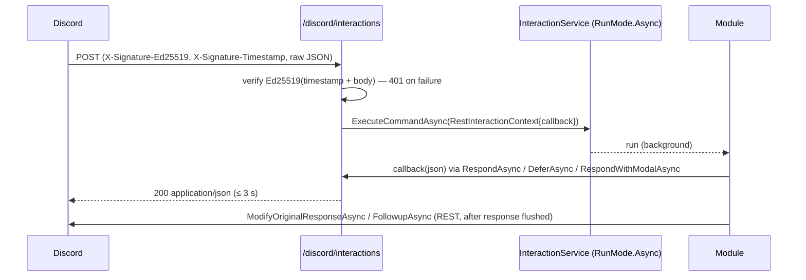

# HTTP interactions — reference implementation

Discord POSTs every interaction to your **Interactions Endpoint URL**; you answer in the HTTP response. No
gateway connection, no long-lived process, scales like any ASP.NET Core app. Trade-off: no guild events
(members, messages, reactions, voice) — pair with Webhook Events for installs/entitlements.

**This code compiles against Discord.Net 3.20.1; the end-to-end tests in [testing.md](testing.md) POST
Ed25519-signed Discord payloads to it and assert the response JSON** (PING, bad/malformed signatures,
Components V2 reply, modal, deferral, unknown command, webhook events).

## Contents
1. How it works
2. Registration
3. Endpoint
4. Startup (modules, login, command registration, error replies)
5. Modules (RestInteractionModuleBase)
6. Deployment & portal setup
7. Gotchas specific to HTTP mode

## 1. How it works



Key mechanics of Discord.Net in HTTP mode:
- `DiscordRestClient.ParseHttpInteractionAsync(publicKey, sig, ts, body, doApiCallOnCreation)` verifies and
  parses (Newtonsoft internally). Pass `_ => false` so it doesn't make REST calls inside your 3 s budget.
- `RestInteraction.Respond/Defer/RespondWithModal` **return JSON strings** instead of sending.
  `RestInteractionModuleBase<T>` forwards that JSON to `RestInteractionContext.InteractionResponseCallback`.
- Follow-ups and edits are real REST calls → the `DiscordRestClient` must be logged in with the bot token.

## 2. Registration

`DiscordHttpExtensions.cs`

```csharp
using Discord;
using Discord.Interactions;
using Discord.Rest;
using MyApp.Discord;
using MyApp.Discord.Announcements;
using MyApp.Discord.Search;

namespace MyApp.Interactions;

public static class DiscordHttpExtensions
{
    public static IServiceCollection AddDiscordHttpInteractions(this IServiceCollection services)
    {
        services.AddOptions<DiscordOptions>()
            .BindConfiguration(DiscordOptions.SectionName)
            .Validate(o => o.PublicKey.Length == 64, "Discord:PublicKey must be the 64-char hex public key")
            // Production needs a logged-in client: follow-ups/edits are REST calls, and Discord.Net dereferences
            // CurrentUser when parsing DM interactions. Development may run without a token (guild interactions only).
            .Validate<IHostEnvironment>((o, env) => env.IsDevelopment() || !string.IsNullOrWhiteSpace(o.Token),
                "Discord:Token is required outside Development")
            .ValidateOnStart();

        services.AddSingleton(new DiscordRestConfig
        {
            LogLevel = LogSeverity.Info,
            UseInteractionSnowflakeDate = false, // measure the 3 s window from receipt, not from the snowflake
        });
        services.AddSingleton(sp => new DiscordRestClient(sp.GetRequiredService<DiscordRestConfig>()));
        services.AddSingleton<IDiscordClient>(sp => sp.GetRequiredService<DiscordRestClient>());
        services.AddSingleton(sp => new InteractionService(sp.GetRequiredService<DiscordRestClient>(),
            new InteractionServiceConfig
            {
                DefaultRunMode = RunMode.Async, // same semantics as the gateway host (results via InteractionExecuted)
                ThrowOnError = false,           // handled in InteractionExecuted
                UseCompiledLambda = true,
                LogLevel = LogSeverity.Info,
            }));
        services.AddHostedService<DiscordHttpStartup>();
        services.AddHealthChecks();
        // Real apps: a scoped EF Core inbox (DbContext) — the Webhook Events endpoint resolves it per request.
        services.AddSingleton<IWebhookEventInbox, InMemoryWebhookEventInbox>();

        services.AddSingleton<AnnouncementQueue>();
        services.AddSingleton<IAnnouncementQueue>(sp => sp.GetRequiredService<AnnouncementQueue>());
        services.AddHostedService<AnnouncementPublisher>();

        services.AddSingleton<IDocsSearch, InMemoryDocsSearch>();
        return services;
    }
}
```

`Program.cs`

```csharp
using MyApp.Interactions;

var builder = WebApplication.CreateBuilder(args);
builder.Services.AddDiscordHttpInteractions();

var app = builder.Build();
app.MapDiscordInteractions("/discord/interactions");
app.MapDiscordWebhookEvents("/discord/events");
app.MapHealthChecks("/health/live", new() { Predicate = _ => false }); // dependency-free: Discord's state never restarts the app
app.Run();

public partial class Program;
```

The endpoint never awaits the command: it dispatches with `Task.Run` and answers as soon as the module's first
response (respond/defer/modal) reaches the callback, so it works under either run mode. `RunMode.Async` is kept
so failures surface through `InteractionExecuted` exactly as on the gateway and the shared error handler applies.

## 3. Endpoint

`DiscordInteractionsEndpoint.cs`

```csharp
using System.Text.Json;
using Discord.Interactions;
using Discord.Rest;
using Microsoft.Extensions.Options;
using MyApp.Discord;

namespace MyApp.Interactions;

/// <summary>
/// Discord's "Interactions Endpoint URL": Discord POSTs every interaction here instead of sending it over the gateway.
/// Contract: verify the Ed25519 signature on the raw body (401 otherwise — Discord probes with bad signatures and
/// removes the URL if you accept them), answer PING with {"type":1}, and return the initial response within 3 s.
/// </summary>
public static class DiscordInteractionsEndpoint
{
    private static readonly TimeSpan ResponseBudget = TimeSpan.FromMilliseconds(2500); // leave headroom under 3 s
    private const int MaxBodyBytes = 1024 * 1024; // interaction payloads are small; refuse to buffer more unauthenticated bytes
    private static readonly TimeSpan MaxClockSkew = TimeSpan.FromMinutes(5); // replay window for signed requests

    public static IEndpointConventionBuilder MapDiscordInteractions(this IEndpointRouteBuilder app, string pattern)
    {
        // Root provider: commands run (RunMode.Async) after this request ends, so they must not use RequestServices.
        var root = app.ServiceProvider;
        return app.MapPost(pattern, (HttpContext http) => HandleAsync(http, root))
            .DisableAntiforgery()   // authenticated by signature, not cookies — the BFF/antiforgery rules don't apply here
            .ExcludeFromDescription();
        // Optionally chain .RequireRateLimiting("discord") with a generous per-IP partition (Discord calls from
        // many IPs): the body cap bounds memory, the limiter bounds Ed25519 work from unauthenticated callers.
    }

    private static async Task HandleAsync(HttpContext http, IServiceProvider root)
    {
        var rest = root.GetRequiredService<DiscordRestClient>();
        var interactions = root.GetRequiredService<InteractionService>();
        var publicKey = root.GetRequiredService<IOptions<DiscordOptions>>().Value.PublicKey;
        var logger = root.GetRequiredService<ILoggerFactory>().CreateLogger(typeof(DiscordInteractionsEndpoint));
        var now = (root.GetService<TimeProvider>() ?? TimeProvider.System).GetUtcNow();

        var signature = http.Request.Headers["X-Signature-Ed25519"].ToString();
        var timestamp = http.Request.Headers["X-Signature-Timestamp"].ToString();

        // The signature covers timestamp + the exact raw bytes: read the body yourself, never model-bind it.
        // Bounded read — a Content-Length check alone is bypassed by chunked requests.
        var body = await DiscordSignedRequest.ReadBodyAsync(http.Request, MaxBodyBytes, http.RequestAborted);
        if (body is null)
        {
            http.Response.StatusCode = StatusCodes.Status413PayloadTooLarge;
            return;
        }

        // Discord.Net doesn't check freshness: a captured request would otherwise be replayable forever.
        if (!DiscordSignedRequest.IsFresh(timestamp, now, MaxClockSkew)
            || !DiscordSignedRequest.IsValidSignature(rest, publicKey, signature, timestamp, body))
        {
            http.Response.StatusCode = StatusCodes.Status401Unauthorized;
            return;
        }

        // PING (type 1): answer directly. Discord.Net's parser requires a user object a PING may not carry.
        if (IsPing(body))
        {
            await WriteJsonAsync(http, """{"type":1}""");
            return;
        }

        // doApiCallOnCreation: false — don't spend the 3 s budget on REST lookups of channel/guild during parsing.
        // Note: with no API call, RestInteraction.Guild stays null — guild-based preconditions such as
        // [RequireUserPermission] can't evaluate (see http-interactions.md). Signature is re-verified here (cheap).
        var interaction = await rest.ParseHttpInteractionAsync(publicKey, signature, timestamp, body, _ => false);
        if (interaction is null)
        {
            // Interaction type Discord.Net doesn't model (e.g. PRIMARY_ENTRY_POINT for Activities).
            logger.LogWarning("Unsupported interaction type received");
            http.Response.StatusCode = StatusCodes.Status400BadRequest;
            return;
        }

        var initialResponse = new TaskCompletionSource<string>(TaskCreationOptions.RunContinuationsAsynchronously);
        var delivered = new TaskCompletionSource(TaskCreationOptions.RunContinuationsAsynchronously);
        var context = new RestInteractionContext(rest, interaction, async json =>
        {
            initialResponse.TrySetResult(json);
            // Hold the command until the HTTP response is flushed, so a FollowupAsync/ModifyOriginalResponseAsync
            // right after DeferAsync doesn't race Discord receiving the deferral ("Unknown interaction").
            await delivered.Task.WaitAsync(TimeSpan.FromSeconds(5));
        });

        // Dispatch OFF the request path. Even under RunMode.Async, unknown commands and stale buttons raise
        // InteractionExecuted *inline* inside ExecuteCommandAsync — its error reply goes through the callback above,
        // which waits for this request to flush. Awaiting dispatch here would deadlock that path for 5 s.
        var dispatch = Task.Run(() => interactions.ExecuteCommandAsync(context, root));
        _ = dispatch.ContinueWith(t => logger.LogError(t.Exception, "Dispatching interaction {InteractionId} failed", interaction.Id),
            TaskContinuationOptions.OnlyOnFaulted);

        string json;
        try
        {
            json = await initialResponse.Task.WaitAsync(ResponseBudget, http.RequestAborted);
        }
        catch (Exception ex) when (ex is TimeoutException or OperationCanceledException)
        {
            // Budget exceeded or Discord hung up: a late Respond/Defer fails fast instead of waiting 5 s on the gate.
            delivered.TrySetCanceled();
            if (ex is OperationCanceledException)
            {
                return; // RequestAborted — nobody is listening for a status code
            }

            logger.LogWarning("Interaction {InteractionId} produced no initial response within {Budget} ms — defer slow work",
                interaction.Id, ResponseBudget.TotalMilliseconds);
            http.Response.StatusCode = StatusCodes.Status500InternalServerError;
            return;
        }

        http.Response.OnCompleted(() =>
        {
            delivered.TrySetResult();
            return Task.CompletedTask;
        });
        await WriteJsonAsync(http, json);
    }

    private static bool IsPing(byte[] body)
    {
        var reader = new Utf8JsonReader(body);
        while (reader.Read())
        {
            if (reader.TokenType == JsonTokenType.PropertyName && reader.CurrentDepth == 1 && reader.ValueTextEquals("type"u8))
            {
                return reader.Read() && reader.TokenType == JsonTokenType.Number && reader.GetInt32() == 1;
            }

            if (reader.TokenType is JsonTokenType.StartObject or JsonTokenType.StartArray && reader.CurrentDepth > 0)
            {
                reader.Skip();
            }
        }

        return false;
    }

    private static Task WriteJsonAsync(HttpContext http, string json)
    {
        http.Response.StatusCode = StatusCodes.Status200OK;
        http.Response.ContentType = "application/json";
        return http.Response.WriteAsync(json);
    }
}
```

Shared by this endpoint and the Webhook Events endpoint (app-integration.md §5):

`DiscordSignedRequest.cs`

```csharp
using System.Globalization;
using Discord.Rest;

namespace MyApp.Interactions;

/// <summary>Raw-body reading and Ed25519 checks for requests Discord signs (interactions, Webhook Events).</summary>
public static class DiscordSignedRequest
{
    /// <summary>
    /// Reads the raw body, stopping after <paramref name="maxBytes"/> — also for chunked requests without a
    /// Content-Length. Returns <c>null</c> when the body is larger than allowed.
    /// </summary>
    public static async Task<byte[]?> ReadBodyAsync(HttpRequest request, int maxBytes, CancellationToken ct)
    {
        if (request.ContentLength > maxBytes)
        {
            return null; // cheap early exit when the client declares the size
        }

        using var buffer = new MemoryStream();
        var chunk = new byte[16 * 1024];
        int read;
        while ((read = await request.Body.ReadAsync(chunk, ct)) > 0)
        {
            if (buffer.Length + read > maxBytes)
            {
                return null;
            }

            buffer.Write(chunk, 0, read);
        }

        return buffer.ToArray();
    }

    /// <summary>Ed25519 over timestamp + body. Malformed headers are <c>false</c> (→ 401), never an exception (→ 500).</summary>
    public static bool IsValidSignature(DiscordRestClient rest, string publicKey, string signature, string timestamp, byte[] body)
    {
        if (signature.Length != 128 || timestamp.Length == 0)
        {
            return false;
        }

        try
        {
            return rest.IsValidHttpInteraction(publicKey, signature, timestamp, body);
        }
        catch (Exception)
        {
            return false; // Discord.Net's hex parser throws on malformed input
        }
    }

    /// <summary>Replay guard: the signed Unix-seconds timestamp must lie within ±<paramref name="maxSkew"/> of now.</summary>
    public static bool IsFresh(string timestamp, DateTimeOffset now, TimeSpan maxSkew) =>
        long.TryParse(timestamp, NumberStyles.None, CultureInfo.InvariantCulture, out var seconds)
        && seconds <= DateTimeOffset.MaxValue.ToUnixTimeSeconds()
        && (now - DateTimeOffset.FromUnixTimeSeconds(seconds)).Duration() <= maxSkew;
}
```

Design points:
- **Raw bytes, bounded**: the signature covers the exact body — model binding or re-serialization breaks it.
  The read stops at 1 MiB even without a Content-Length (chunked), so unauthenticated callers can't make you
  buffer arbitrary amounts.
- **401 for anything unverifiable**, including malformed hex (Discord.Net's hex parser throws → would be 500).
- **PING handled before parsing**: Discord.Net's parser requires a `user`/`member` object; a PING may lack one.
- **Timestamp freshness**: Discord.Net doesn't check it, so the endpoint rejects timestamps more than 5 minutes
  from now (401). Handlers with side effects should still be idempotent on `interaction.Id`. A host clock that
  drifts by minutes now fails every request — keep NTP on.
- **Dispatch off the request path** (`Task.Run`) — a deliberate exception to the "no `Task.Run` in handlers"
  rule of `noobit:aspnet-backend`: the command must outlive the response (it edits/follows up after the
  deferral is flushed). Unknown commands and stale buttons raise
  `InteractionExecuted` *inline* inside `ExecuteCommandAsync` even under `RunMode.Async`; the error reply flows
  through the callback, which waits for this request to flush — awaiting dispatch would deadlock that path for
  5 s and Discord would show "did not respond". The tests assert the < 2 s budget for both cases.
- **Root service provider — only for work that outlives the request**: the command keeps running after the
  response; `RequestServices` would be disposed underneath it. `AutoServiceScopes` creates a fresh scope per
  execution from the root. Anything used *within* the request (e.g. the Webhook Events inbox) comes from
  `http.RequestServices` instead — resolving a scoped service from the root throws under `ValidateScopes` or
  becomes a captive dependency.
- **Delivered gate**: the module's callback awaits the response flush, so `ModifyOriginalResponseAsync`
  straight after `DeferAsync` doesn't race Discord ("Unknown interaction" / "Unknown Webhook").
- **2.5 s budget** with a warning: a command that neither responds nor defers is a bug — make it defer.
  On timeout — or when Discord aborts the request — the delivered gate is cancelled, so a late `RespondAsync`
  fails fast instead of stalling 5 s; late responses are dropped (Discord has already given up).
- Antiforgery is disabled for this endpoint: it is authenticated by signature, not cookies. The cookie-BFF
  rules (`noobit:bff-security`) apply to your browser endpoints, not to Discord's machine-to-machine calls.

## 4. Startup

`DiscordHttpStartup.cs`

```csharp
using Discord;
using Discord.Interactions;
using Discord.Rest;
using Microsoft.Extensions.Options;
using MyApp.Discord;
using IResult = Discord.Interactions.IResult; // ASP.NET Core has its own IResult

namespace MyApp.Interactions;

/// <summary>
/// Builds the interaction modules before Kestrel accepts requests, logs the REST client in (needed for
/// follow-ups, edits, command registration and outbound posts) and registers commands once per deployment.
/// </summary>
public sealed class DiscordHttpStartup(
    DiscordRestClient rest,
    InteractionService interactions,
    IServiceProvider services,
    IOptions<DiscordOptions> options,
    ILogger<DiscordHttpStartup> logger) : IHostedService
{
    public async Task StartAsync(CancellationToken cancellationToken)
    {
        rest.Log += message => DiscordLog.Write(logger, message);
        interactions.Log += message => DiscordLog.Write(logger, message);
        interactions.InteractionExecuted += HandleExecutedAsync;

        await interactions.AddModulesAsync(typeof(DiscordHttpStartup).Assembly, services);

        if (string.IsNullOrWhiteSpace(options.Value.Token))
        {
            logger.LogWarning("Discord:Token not set (Development only) — guild interactions are answered; DM interactions, follow-ups, registration and posts fail");
            return;
        }

        // DiscordRestClient.LoginAsync calls users/@me — 401 fails startup. Neither call takes a cancel token and
        // RetryMode.AlwaysRetry retries 502s, so WaitAsync keeps a Discord outage from hanging startup forever.
        await rest.LoginAsync(TokenType.Bot, options.Value.Token).WaitAsync(cancellationToken);
        if (options.Value.DevGuildId is { } guildId)
        {
            await interactions.RegisterCommandsToGuildAsync(guildId).WaitAsync(cancellationToken);
        }
        else
        {
            await interactions.RegisterCommandsGloballyAsync().WaitAsync(cancellationToken);
        }
    }

    public Task StopAsync(CancellationToken cancellationToken) => rest.LogoutAsync();

    private async Task HandleExecutedAsync(ICommandInfo? command, IInteractionContext context, IResult result)
    {
        if (result.IsSuccess || context.Interaction is not RestInteraction interaction
            || interaction.Type == InteractionType.ApplicationCommandAutocomplete)
        {
            return;
        }

        if (result.Error is not InteractionCommandError.UnmetPrecondition)
        {
            logger.LogError((result as ExecuteResult?)?.Exception,
                "Interaction {Command} failed: {Error} {Reason}", command?.Name, result.Error, result.ErrorReason);
        }

        var message = result.Error is InteractionCommandError.UnmetPrecondition
            ? result.ErrorReason
            : "Something went wrong. Please try again later.";

        try
        {
            // HTTP mode: the initial response must go through the endpoint callback — Respond() only builds JSON, and
            // IDiscordInteraction.RespondAsync on a RestInteraction silently discards it. Later replies are REST calls.
            var callback = (context as IRestInteractionContext)?.InteractionResponseCallback;
            await InteractionErrors.ReplyAsync(interaction, message, callback is null
                ? null
                : (_, text) => callback(interaction.Respond(text, ephemeral: true, allowedMentions: AllowedMentions.None)));
        }
        catch (Exception ex)
        {
            logger.LogWarning(ex, "Could not deliver error message for interaction {InteractionId}", interaction.Id);
        }
    }
}
```

Error replies in HTTP mode must go through the context callback while the HTTP request is still waiting:
`IDiscordInteraction.RespondAsync` on a `RestInteraction` builds the JSON and **discards it**. Later replies use
the shared `InteractionErrors` helper (gateway-bot.md §4), which never turns a public deferral into a public error.

### Preconditions in HTTP mode

`ParseHttpInteractionAsync(..., _ => false)` skips the guild fetch, so `RestInteraction.Guild` is null and
`RestGuildUser.GuildPermissions` throws — **`[RequireUserPermission]`, `[RequireRole]` and other guild-based
preconditions fail every guild command** (the user sees the generic error). Options:
- Rely on `[DefaultMemberPermissions]` (Discord enforces it client-side; admins can override per role) for
  visibility, and check business rules in your app (e.g. linked account roles in your DB).
- Or pass `doApiCallOnCreation: p => true` for those commands — one REST guild fetch inside the 3 s budget.
- Discord.Net 3.20.1 doesn't expose the payload's `member.permissions`; parse it from the raw body yourself if
  you need it without the REST call.

The client must be **logged in before interactions arrive in production**: besides follow-ups and edits,
Discord.Net dereferences `CurrentUser` when it parses a DM interaction (`RestDMChannel`), which throws on an
anonymous client. Hence `Token` is required outside Development; `DiscordRestClient.LoginAsync` itself calls
`users/@me`, so a bad token fails startup.

Registering commands at startup of every replica is acceptable for a few replicas (bulk overwrite is
idempotent; unchanged commands don't count toward the 200/day create limit). With many replicas, register
from one place — a config flag on one replica or a deployment step (a one-off `--register-commands` run) —
to avoid parallel overwrites.

## 5. Modules

Same attributes as gateway modules, different base class and context. Cards, modals, custom ids and the
autocomplete handler are shared (see [rich-ui.md](rich-ui.md)).

`HttpModules.cs`

```csharp
using Discord;
using Discord.Interactions;
using Discord.Rest;
using MyApp.Discord.Cards;
using MyApp.Discord.Modals;
using MyApp.Discord.Search;

namespace MyApp.Interactions.Modules;

// HTTP modules MUST derive from RestInteractionModuleBase: its Respond/Defer/Modal overrides hand the JSON to the
// endpoint's callback. A plain InteractionModuleBase "responds" into the void and Discord shows "did not respond".
[CommandContextType(InteractionContextType.Guild, InteractionContextType.BotDm, InteractionContextType.PrivateChannel)]
[IntegrationType(ApplicationIntegrationType.GuildInstall, ApplicationIntegrationType.UserInstall)]
public sealed class GeneralModule : RestInteractionModuleBase<RestInteractionContext>
{
    [SlashCommand("about", "What is this app?")]
    public Task AboutAsync() =>
        RespondAsync(
            components: AboutCard.Build("MyApp", "1.0.0", "https://cdn.discordapp.com/embed/avatars/0.png", "https://example.com"),
            flags: MessageFlags.ComponentsV2); // REST responses do NOT auto-add the V2 flag — always pass it
}

[CommandContextType(InteractionContextType.Guild, InteractionContextType.BotDm, InteractionContextType.PrivateChannel)]
[IntegrationType(ApplicationIntegrationType.GuildInstall, ApplicationIntegrationType.UserInstall)]
public sealed class SearchModule(IDocsSearch search) : RestInteractionModuleBase<RestInteractionContext>
{
    [SlashCommand("search", "Search the documentation")]
    public async Task SearchAsync(
        [Summary(description: "What are you looking for?"), MinLength(2), MaxLength(80), Autocomplete<DocsAutocomplete>]
        string query)
    {
        await DeferAsync(); // becomes the HTTP response (type 5); the edit below is a real REST call

        using var timeout = new CancellationTokenSource(TimeSpan.FromSeconds(30));
        var hits = await search.SearchAsync(query, timeout.Token);
        await ModifyOriginalResponseAsync(m =>
        {
            m.Components = SearchCard.Build(query, hits, page: 0);
            m.Flags = MessageFlags.ComponentsV2;
            m.AllowedMentions = AllowedMentions.None;
        });
    }

    [ComponentInteraction(CustomIds.SearchPagePattern)]
    public async Task PageAsync(int page, string query)
    {
        await DeferAsync(); // DEFERRED_UPDATE_MESSAGE
        using var timeout = new CancellationTokenSource(TimeSpan.FromSeconds(30));
        var hits = await search.SearchAsync(query, timeout.Token);
        await ModifyOriginalResponseAsync(m => m.Components = SearchCard.Build(query, hits, page));
    }
}

[CommandContextType(InteractionContextType.Guild, InteractionContextType.BotDm, InteractionContextType.PrivateChannel)]
[IntegrationType(ApplicationIntegrationType.GuildInstall, ApplicationIntegrationType.UserInstall)]
public sealed class FeedbackModule(ILogger<FeedbackModule> logger) : RestInteractionModuleBase<RestInteractionContext>
{
    [SlashCommand("feedback", "Send feedback to the team")]
    public Task FeedbackAsync() => RespondWithModalAsync<FeedbackModal>(CustomIds.FeedbackModal);

    [ModalInteraction(CustomIds.FeedbackModal)]
    public Task SubmitAsync(FeedbackModal feedback)
    {
        logger.LogInformation("Feedback from {UserId} ({Length} chars)", Context.User.Id, feedback.Body.Length); // never log the body
        return RespondAsync(components: FeedbackCard.Thanks(feedback), ephemeral: true,
            allowedMentions: AllowedMentions.None, flags: MessageFlags.ComponentsV2);
    }
}
```

## 6. Deployment & portal setup

1. Deploy behind nginx with TLS (`noobit:nginx-deploy`); the route must accept POST from the internet and
   pass the body untouched (no request-body rewriting, no auth middleware in front of it).
2. Configure `Discord:PublicKey` (Portal → General Information) and `Discord:Token` (secret).
3. Portal → General Information → **Interactions Endpoint URL** = `https://your.host/discord/interactions`
   → Save. Discord PINGs and probes a bad signature; save fails if either answer is wrong.
4. Serverless/scale-to-zero hosting only with warm instances (min replicas ≥ 1): the 3 s deadline includes cold
   start, and a cold start that exceeds it is a "did not respond".
5. Local development: expose the dev server through a tunnel (e.g. `cloudflared tunnel --url http://localhost:5000`)
   and use a separate **development application** with `DevGuildId` set — never point the production app's
   endpoint at a laptop.
6. To switch an app back to the gateway, clear the endpoint URL.
7. Command registration: every replica is fine for a few; with many, one replica (config flag) or a deployment step.
8. Document the endpoint URL, portal settings and the transport decision in `docs/` (ADR via `/noobit:adr`).

## 7. Gotchas specific to HTTP mode

| Symptom | Cause | Fix |
|---|---|---|
| Discord: "The application did not respond", logs fine | Module derives from `InteractionModuleBase` | `RestInteractionModuleBase<RestInteractionContext>` |
| 400 "Invalid Form Body" on V2 reply | REST responses don't auto-add the V2 flag | `flags: MessageFlags.ComponentsV2` |
| Follow-up throws "Client is not logged in" | `DiscordRestClient` never logged in | Token configured + `LoginAsync` at startup |
| Edit after defer → 404 Unknown interaction | Edit raced the HTTP response | Delivered gate in the callback (above) |
| Portal refuses the URL | PING not `{"type":1}` or bad signature not 401 | See endpoint; test both |
| `ObjectDisposedException` in commands | Executed with `RequestServices` | Root provider + `AutoServiceScopes` |
| Error handler's message never arrives | Used `interaction.RespondAsync` | Context callback with `interaction.Respond(...)` |
| `IResult` ambiguous | ASP.NET Core vs Discord.Interactions | `using IResult = Discord.Interactions.IResult;` |
| Every guild command answers "Something went wrong" | `[RequireUserPermission]` with `doApiCall: false` (Guild is null) | See "Preconditions in HTTP mode" |
| 500 on some interactions | `ParseHttpInteractionAsync` returns null for types it doesn't model (e.g. PRIMARY_ENTRY_POINT) | Null guard → 400 (endpoint above) |
| DM interactions throw `NullReferenceException` | Anonymous `DiscordRestClient` (parsing reads `CurrentUser`) | Log in before serving |
