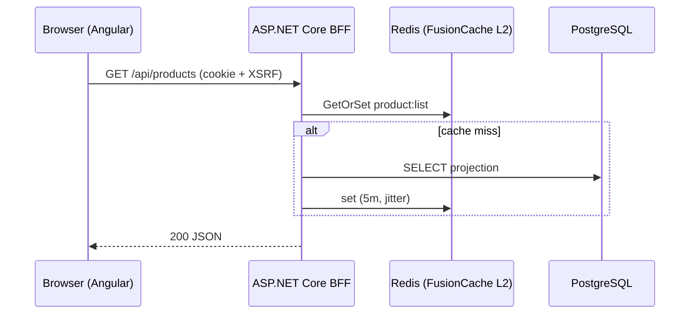

# Docs Maintenance

## Overview

Every project has a `docs/` folder of markdown that is **part of the change, not an afterthought**: any change to behavior, architecture, endpoints, config, events, or deployment updates the affected docs in the same commit. Docs are cross-referenced (every doc reachable from the index, related docs linked both ways) and diagrams are Mermaid.

## Standard structure

```
docs/
  README.md              # index — links to every doc with a one-line description
  architecture.md        # system overview + container/component Mermaid diagrams
  getting-started.md     # clone → run locally (docker compose) → test
  deployment.md          # build, compose, nginx, certs (see docker-nginx-deploy)
  security.md            # BFF model, cookies, CSRF, headers
  api.md                 # endpoint overview (detail lives in OpenAPI; this is the map)
  data-model.md          # ER diagram + ownership/consistency notes
  messaging.md           # exchanges, queues, events (only if RabbitMQ used)
  features/
    <feature-name>.md    # one per non-trivial feature: purpose, flow, decisions
  adr/
    0001-<decision>.md   # architecture decision records, numbered, never edited after acceptance
```

Scale down for small projects (README.md + architecture.md minimum) — but the index rule always holds.

## Cross-reference rules

1. `docs/README.md` links **every** doc; a doc not in the index is lost.
2. Each doc starts with a one-line purpose and ends with a `## Related` section linking sibling docs *in both directions* (if `api.md` links `security.md`, `security.md` links back).
3. Relative links only (`[Security](security.md)`, `[ADR-0003](adr/0003-caching.md)`); link to headings with anchors when pointing at a section.
4. Link code by path in backticks (`src/App.Api/Features/Orders/`) — paths get stale-checked, line numbers don't.
5. When renaming/removing a doc: `grep` the whole `docs/` tree for the old filename and fix every reference.

## Mermaid conventions

Use the right diagram per question — architecture: `flowchart TB` (containers/dependencies; `graph` is the legacy alias), flows: `sequenceDiagram`, data: `erDiagram`, lifecycles: `stateDiagram-v2`.



Keep diagrams small (≤ ~12 nodes) — two focused diagrams beat one wall chart. Diagrams live next to the prose that explains them, and are updated with the change that invalidates them.

## Update triggers → affected docs

| Change | Update |
|---|---|
| New/changed endpoint | `api.md`, feature doc |
| New service/container/dependency | `architecture.md` diagram, `deployment.md`, compose |
| New event/queue | `messaging.md` |
| Schema change | `data-model.md` ER diagram |
| Auth/cookie/header change | `security.md` |
| New env var / config key | `deployment.md`, `getting-started.md` |
| Significant tech choice | new ADR (context → decision → consequences) |

The `docs-maintainer` agent / `/docs-sync` command automates this: it diffs the working tree, maps changes through this table, and updates the affected files + index + back-links.

## Common mistakes

| Mistake | Fix |
|---|---|
| "I'll document it later" | Same commit, or it never happens |
| Doc exists but index doesn't link it | Index is mandatory; check on every new doc |
| One-way links | `## Related` sections link both directions |
| ASCII-art / image-file diagrams | Mermaid in the markdown |
| Restating code line-by-line | Document intent, flows, and decisions — not syntax |
| Editing accepted ADRs | New ADR that supersedes (link both) |

## Official docs — verify, don't guess

When diagram syntax is uncertain, WebFetch the official docs instead of guessing:
- Mermaid: https://mermaid.js.org/intro/
- **Established patterns & current versions (verified July 2026): [references/best-practices.md](references/best-practices.md) — read it before writing code in this area.**
