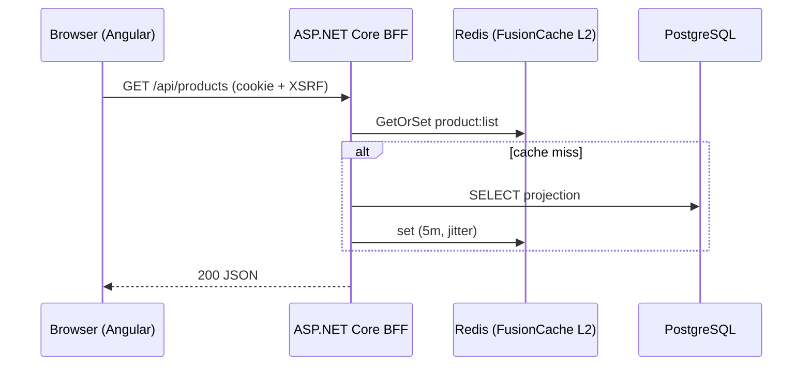

# Docs Maintenance

## Overview

Every project has a `docs/` folder of markdown that is **part of the change, not an afterthought**: any change to behavior, architecture, endpoints, config, events, or deployment updates the affected docs in the same commit. Docs are cross-referenced (every doc reachable from the index, related docs linked both ways) and diagrams are Mermaid.

## Standard structure

```
docs/
  README.md              # index — links to every doc with a one-line description
  architecture.md        # system overview + container/component Mermaid diagrams
  getting-started.md     # clone → run locally (docker compose) → test
  deployment.md          # build, compose, nginx, certs (see docker / nginx-deploy)
  security.md            # BFF model, cookies, CSRF, headers
  api.md                 # endpoint map — groups, auth, links to the generated OpenAPI doc; never hand-copied schemas
  data-model.md          # ER diagram + ownership/consistency notes
  messaging.md           # exchanges, queues, events (only if RabbitMQ used)
  features/
    <feature-name>.md    # one per non-trivial feature: purpose, flow, decisions
  adr/                   # decision records — owned by noobit:adr (date-named, generated index.md)
  rfc/                   # design proposals — owned by noobit:rfc (date-named, generated index.md)
```

ADRs and RFCs are **not** written by hand under this skill: their format, file naming
(`YYYY-MM-DD-kebab-title.md`, no numbers), status lifecycle and generated `index.md` belong to the
`adr` and `rfc` skills (authored via `/noobit:adr` / `/noobit:rfc`, tech-lead agent).

Scale down for small projects (README.md + architecture.md minimum) — but the index rule always holds.

The root `README.md` stays short (what it is, quick start, link to `docs/README.md`) — it points into
`docs/`, it does not duplicate it. When a getting-started step or doc name changes, update both.

**Existing repos win.** If docs already live elsewhere (e.g. a `wiki/` folder, a published wiki with its
own front matter, `:::mermaid` fences on Azure DevOps), follow that location and syntax — don't
introduce a parallel `docs/` tree. Apply the rules here (index, cross-links, update triggers) within it.

## Cross-reference rules

1. `docs/README.md` links **every** doc; a doc not in the index is lost. For `adr/` and `rfc/` it links
   their generated `index.md` once — not the individual records.
2. Each doc starts with a one-line purpose and ends with a `## Related` section linking sibling docs *in both directions* (if `api.md` links `security.md`, `security.md` links back). **Exception:** ADR/RFC records — accepted records are immutable apart from their status line, so they get no back-links; link *to* them from the docs that depend on the decision.
3. Relative links only (`[Security](security.md)`, `[Use FusionCache](adr/2026-07-11-use-fusioncache.md)`); link to headings with anchors when pointing at a section.
4. Link code by path in backticks (`src/App.Api/Features/Orders/`) — paths get stale-checked, line numbers don't.
5. When renaming/removing a doc: `grep` the whole `docs/` tree for the old filename and fix every reference.

## Out of scope — never index or touch

The `work/` folder (specs and plans produced by superpowers brainstorming/writing-plans) and any legacy `docs/superpowers/` content are **working documents, not documentation**: never add them to the index, never link them from `docs/`, never reformat or "fix" them. They follow the process skills' own conventions.

## Mermaid conventions

Use the right diagram per question — architecture: `flowchart TB` (containers/dependencies; `graph` is the legacy alias), flows: `sequenceDiagram`, data: `erDiagram`, lifecycles: `stateDiagram-v2`.


```mermaid
sequenceDiagram
    accTitle: Cached product list read
    accDescr: The BFF serves the product list from Redis and falls back to PostgreSQL on a cache miss
    participant B as Browser (Angular)
    participant BFF as ASP.NET Core BFF
    participant R as Redis (FusionCache L2)
    participant DB as PostgreSQL
    B->>BFF: GET /api/products (cookie + XSRF)
    BFF->>R: GetOrSet product:list
    alt cache miss
        BFF->>DB: SELECT projection
        BFF->>R: set (5m, jitter)
    end
    BFF-->>B: 200 JSON
```

Every diagram gets `accTitle` + `accDescr` (screen readers). Keep diagrams small (≤ ~12 nodes) — two focused diagrams beat one wall chart. Diagrams live next to the prose that explains them, and are updated with the change that invalidates them.

## Update triggers → affected docs

| Change | Update |
|---|---|
| New/changed endpoint | `api.md`, feature doc |
| New service/container/dependency | `architecture.md` diagram, `deployment.md`, compose |
| New event/queue | `messaging.md` |
| Schema change | `data-model.md` ER diagram |
| Auth/cookie/header change | `security.md` |
| New env var / config key | `deployment.md`, `getting-started.md` |
| Significant tech choice | new ADR via `/noobit:adr` (tech-lead agent) |
| Up-front design for a large change | RFC via `/noobit:rfc` |

The `docs-maintainer` agent / `/docs-sync` command automates this: it diffs the working tree, maps changes through this table, and updates the affected files + index + back-links.

## Common mistakes

| Mistake | Fix |
|---|---|
| "I'll document it later" | Same commit, or it never happens |
| Doc exists but index doesn't link it | Index is mandatory; check on every new doc |
| One-way links | `## Related` sections link both directions |
| Broken links after a rename | `lychee --offline --include-fragments 'docs/**/*.md'` (see reference) |
| ASCII-art / image-file diagrams | Mermaid in the markdown |
| Restating code line-by-line | Document intent, flows, and decisions — not syntax |
| Editing accepted ADRs | New ADR that supersedes it (`noobit:adr` — only the old record's status line changes) |
| Hand-written, numbered ADRs (`0001-…`) | `/noobit:adr` — date-named records + generated index |

## Reference

**Read [references/best-practices.md](references/best-practices.md) before writing docs or diagrams** — Mermaid version and renderer differences (v12 layout/look), stable vs. experimental diagram types, link checking (verified October 2026).

## Official docs — verify, don't guess

When diagram syntax is uncertain, WebFetch the official docs instead of guessing:
- Mermaid: https://mermaid.js.org/intro/
