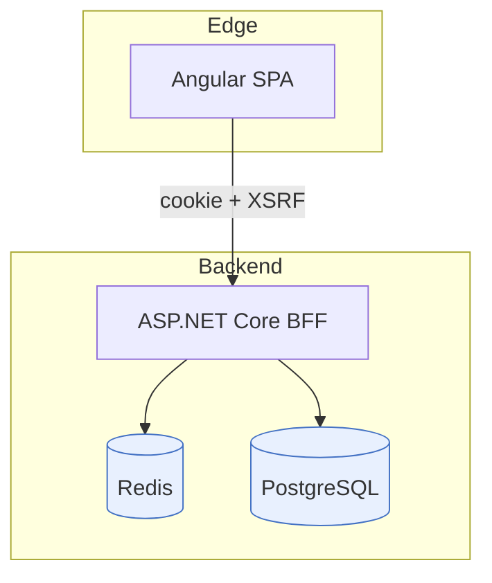

# Docs-as-Code Best Practices — Markdown + Mermaid

Verified against official documentation, July 2026. Primary sources: mermaid.js.org (intro, flowchart, sequenceDiagram, entityRelationshipDiagram, stateDiagram, c4, accessibility), diataxis.fr, adr.github.io, docs.github.com. Full URL list in [Sources](#sources).

## Current versions (July 2026)

- **Mermaid 11.16.0** is current (mermaid.js.org).
- **Stable diagram types** (safe for long-lived docs): flowchart, sequenceDiagram, classDiagram, stateDiagram-v2, erDiagram, gantt, gitGraph, pie, journey, quadrantChart, requirementDiagram, mindmap, timeline.
- **Experimental / subject to change** (avoid in durable docs, or expect rework): **C4** (`C4Context`, `C4Container`, `C4Component`, `C4Dynamic`, `C4Deployment` — official warning: "This is an experimental diagram for now. The syntax and properties can change in future releases"), sankey, xychart, block, packet, kanban, architecture, radar, treemap, and other 🔥-marked types.
  - For C4-style architecture views in durable docs, prefer a plain `flowchart TB` with subgraphs — same information, stable syntax.
- **Native rendering** (no plugins), verified July 2026:
  - **GitHub**: ```` ```mermaid ```` fenced blocks render in markdown files, READMEs, issues, PRs, discussions, and wikis. GitHub pins its own Mermaid version, which can lag the latest release — check before using brand-new syntax (docs.github.com).
  - **GitLab**: native in repo markdown, issues, MRs, wikis, snippets; supports `click` node links; tracks recent Mermaid releases closely.
  - **VS Code**: built-in Markdown preview renders Mermaid natively since **VS Code 1.121 (May 2026)**; the former `bierner.markdown-mermaid` extension is deprecated/merged in. No extension needed on current VS Code.
- Renderer versions differ across platforms → write to the **oldest renderer you target** (usually GitHub) and prefer long-stable syntax over latest features (e.g. v11.12+ half-arrows, v11.16 nullable `?` attribute types).

## Established patterns

### Diátaxis quadrants → this setup's docs/ structure

Diátaxis (diataxis.fr, Daniele Procida) splits docs along two axes — action vs. cognition, acquisition vs. application — into four types that must **not** be mixed in one document:

| Quadrant | Serves | In this setup |
|---|---|---|
| Tutorial (learning-oriented) | Newcomer acquiring skill by doing | `getting-started.md` — clone → run → test, guaranteed to work end-to-end |
| How-to guide (task-oriented) | Competent user achieving a goal | `deployment.md` (and operational parts of `security.md`) — goal-directed steps, assumes competence |
| Reference (information-oriented) | User looking up facts | `api.md`, `data-model.md` — neutral, complete, structured like the system itself |
| Explanation (understanding-oriented) | Reader seeking the "why" | `architecture.md`, `adr/`, `features/*.md` decision sections |

Practical rules from the framework:
- One document, one quadrant. When a how-to starts explaining rationale, extract it to `architecture.md` or an ADR and link.
- Tutorials must be reliable and concrete — no choices, no digressions. How-tos may branch; tutorials never.
- Reference describes, it does not instruct. Keep usage examples minimal; put workflows in how-tos.
- The `docs/README.md` index groups by these needs, so readers self-select by what they are trying to do.

### ADRs (Nygard format, per adr.github.io)

- One record per architecturally significant decision. Sections, in order: **Title** (short noun phrase, imperative decision), **Status**, **Context** (forces, constraints — neutral tone), **Decision** ("We will …"), **Consequences** (all of them: positive, negative, neutral).
- **Lifecycle**: `proposed → accepted`, later `deprecated` or `superseded by ADR-NNNN`. An accepted ADR is immutable except for its Status line; changing your mind means a **new** ADR that supersedes the old, with links both ways (matches SKILL.md's "never edited after acceptance").
- Number sequentially, zero-padded filenames (`adr/0007-switch-to-fusioncache.md`); never reuse numbers, even for rejected ADRs.
- MADR is the maintained richer template (adds options considered / decision drivers); Nygard's five sections are the floor. Add "Options considered" when the trade-off is the point.

Minimal Nygard skeleton:

```markdown
# ADR-0007: Use FusionCache with Redis L2

## Status
Accepted (2026-07-11). Supersedes [ADR-0002](0002-imemorycache.md).

## Context
<forces, constraints, requirements — neutral, no advocacy>

## Decision
We will <active-voice decision>.

## Consequences
<positive, negative, and neutral outcomes; follow-up work>
```

### Choosing the diagram type (stable types only)

Extends SKILL.md's mapping with the remaining stable types:

| Question the doc answers | Diagram | Notes |
|---|---|---|
| What are the containers/dependencies? | `flowchart TB` + subgraphs | Stable stand-in for experimental C4 |
| Who calls whom, in what order? | `sequenceDiagram` | `autonumber` for step refs from prose |
| What does the data look like? | `erDiagram` | Crow's foot; attributes with PK/FK/UK |
| What states can this thing be in? | `stateDiagram-v2` | Always the `-v2` variant |
| What's the type/inheritance structure? | `classDiagram` | Only when OO structure is the point |
| When did decisions/releases happen? | `timeline` / `gitGraph` | Stable since v10/v11 |

### Mermaid syntax that survives every renderer

- Start every diagram with an explicit direction: `flowchart TB` (containers/dependencies), `flowchart LR` (pipelines). `TB`/`TD`, `BT`, `LR`, `RL` are the valid keywords. `graph` is the legacy alias for `flowchart`; both render, `flowchart` is the documented current form.
- **Subgraphs**: `subgraph id[Display Title] … end`; give explicit IDs so edges can target the subgraph. A `direction` statement inside a subgraph is **ignored if any of its nodes link outside the subgraph** — structure accordingly.
- **Styling that survives GitHub**: use in-diagram `classDef name fill:#f9f,stroke:#333;` + `class nodeId name;` (or the `nodeId:::name` shorthand). External CSS does not reliably override Mermaid's internal styles, and GitHub strips page-level CSS anyway. Avoid theme-dependent raw colors; test in dark mode.
- **Accessibility** (supported in all diagram types): put these right after the diagram-type line —
  ```
  flowchart TB
      accTitle: Order processing containers
      accDescr: BFF calls Postgres and Redis; RabbitMQ links order and email services
  ```
  Multi-line form: `accDescr { … }`. These render as SVG `<title>`/`<desc>` for screen readers, not visible text. For a visible title use YAML frontmatter (`--- title: … ---`) above the diagram.
- **Sequence diagrams**: declare participants explicitly (`participant BFF as ASP.NET Core BFF`) to control order; `->>` solid call, `-->>` dotted reply, `-)` async; `+`/`-` suffixes for activation; `alt/else`, `opt`, `loop`, `par/and`, `break` blocks; `autonumber` for step references from prose.
- **erDiagram**: crow's-foot cardinality `||` exactly one, `|o` zero-or-one, `}o` zero-or-more, `}|` one-or-more; `--` identifying (child can't exist alone) vs `..` non-identifying; attributes as `type name PK|FK|UK "comment"`.
- **stateDiagram-v2** (always `-v2`): `[*]` start/end, `state Name { … }` composite states, `<<choice>>`/`<<fork>>`/`<<join>>`, `--` for concurrent regions, `%%` comments.
- **Reserved-word traps** (official warnings): a lowercase node/message named `end` breaks flowcharts and sequence diagrams — capitalize (`End`) or wrap (`[end]`, `(end)`). In flowcharts, a lowercase `o` or `x` at the start of a target node id creates an unintended circle/cross edge — add a space or capitalize. Wrap text containing `#`, `;`, `{}`, or parentheses in double quotes.

Renderer-safe template combining the above (verified syntax, renders on GitHub/GitLab/VS Code):



### Link hygiene for cross-referenced markdown

- Relative links only, resolved from the linking file (`security.md`, `adr/0003-caching.md`, `../docs/api.md` never absolute paths or repo URLs — those break in forks and local preview).
- Heading anchors: GitHub/GitLab slugify headings (lowercase, spaces→`-`, punctuation dropped). Renaming a heading silently breaks every `#anchor` link to it — grep for the old slug when renaming.
- Every doc reachable from `docs/README.md`; every cross-reference bidirectional via `## Related` (per SKILL.md). Orphan detection: any `.md` under `docs/` not matched by a grep of the index is a bug.
- Reference code by path in backticks, not line numbers; paths are grep-checkable, line numbers rot.
- On rename/delete: `grep -r "old-name.md" docs/` and fix every hit in the same commit. A CI link checker (e.g. lychee) turns silent rot into a failing build.

## Anti-patterns

| Anti-pattern | Why it fails | Fix |
|---|---|---|
| Tutorial that explains architecture mid-step | Mixes Diátaxis quadrants; learners lose the thread | Link to `architecture.md`/ADR; keep the tutorial linear |
| Reference doc with embedded how-to workflows | Readers can't scan for facts | Move workflows to `deployment.md`; reference stays descriptive |
| Editing an accepted ADR's Decision/Context | Destroys the decision log's audit value | New superseding ADR, update old Status only, link both ways |
| ADR with only the happy consequences | Nygard: consequences include negative and neutral ones | List costs, risks, and follow-up work honestly |
| C4/beta Mermaid diagrams in durable docs | Official docs: syntax "can change in future releases" | `flowchart` + subgraphs for architecture views |
| Node or message literally named `end` (lowercase) | Breaks flowchart/sequence parsing | `End`, `"end"`, or `[end]` |
| `style`/hex colors tuned to one theme | Illegible in GitHub dark mode | `classDef` with mid-contrast fills; check both themes |
| Diagram with 20+ nodes | Unreadable at rendered size; never updated | Split by question (per SKILL.md: ≤ ~12 nodes, two focused diagrams) |
| Using latest-version Mermaid syntax in shared docs | GitHub's pinned Mermaid lags; renders as error block | Target oldest renderer; prefer long-stable syntax |
| No accTitle/accDescr | Diagram invisible to screen readers; text is the whole point of docs-as-code | Add both to every diagram (2 lines) |
| Absolute or repo-URL internal links | Break in forks, branches, local preview | Relative links, anchor-checked |
| Renaming headings without grepping anchors | Silent dead `#fragment` links | Grep old slug across `docs/`; CI link check |

## Sources

- https://mermaid.js.org/intro/
- https://mermaid.js.org/syntax/flowchart.html
- https://mermaid.js.org/syntax/sequenceDiagram.html
- https://mermaid.js.org/syntax/entityRelationshipDiagram.html
- https://mermaid.js.org/syntax/stateDiagram.html
- https://mermaid.js.org/syntax/c4.html
- https://mermaid.js.org/config/accessibility.html
- https://diataxis.fr/
- https://adr.github.io/
- https://docs.github.com/en/get-started/writing-on-github/working-with-advanced-formatting/creating-diagrams
- https://github.com/microsoft/vscode/issues/293028 (built-in Mermaid preview, VS Code 1.121, May 2026)
- https://marketplace.visualstudio.com/items?itemName=bierner.markdown-mermaid (deprecated — merged into VS Code)
