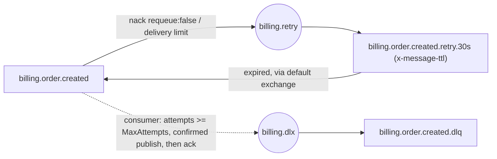

# RabbitMQ Messaging — Best Practices Reference (.NET)

Verified against official documentation, October 2026. Extends `SKILL.md` (topology conventions, outbox, idempotency rules live there). Sources: rabbitmq.com docs (reliability, confirms, quorum-queues, dlx, ttl, production-checklist, heartbeats, release-information), the .NET client API guide and API reference, and nuget.org. Full URL list at the bottom.

## Current versions (verified October 2026)

- **RabbitMQ server: 4.3.x** — latest patch **4.3.6** (2026-09-16) — check https://www.rabbitmq.com/release-information for newer patches and support dates. 4.2.x community support ended 2026-07-31, 4.1.x on 2026-01-31; 3.13.x is out of community support. Target 4.3.x for new deployments — its community support ends 2026-11-30, so plan the move to the next series (4.4) as soon as it ships; older series only with a commercial license.
- **RabbitMQ.Client NuGet: 7.2.2** (2026-08-05; check https://www.nuget.org/packages/RabbitMQ.Client for newer). Ships `net8.0` + `netstandard2.0` targets; runs fine on `net10.0`. Fully async API (`IConnection`/`IChannel`), `CancellationToken` on every operation.

## Established patterns

### Publisher confirms — what a `basic.ack` actually means

Per the confirms guide, the broker acks a message only when **all** queues it was routed to have accepted it:

- Durable queue + persistent message: acked **after persisting to disk** — "latency for `basic.ack` can reach a few hundred milliseconds" because the broker batches fsyncs. Confirms are for correctness, not latency; pipeline or batch publishes for throughput.
- Quorum queue: acked once **a quorum of replicas** has accepted the message.
- Unroutable + `mandatory: true`: the broker sends `basic.return` **before** the confirm — a confirm alone does not prove the message reached a queue. Always publish with `mandatory: true` for messages that must land somewhere.
- `basic.nack` means the broker could not take responsibility (e.g. queue leader lost) — treat as "not sent" and republish.

In RabbitMQ.Client 7.x confirms are configured per channel via `CreateChannelOptions`:

```csharp
var channelOptions = new CreateChannelOptions(
    publisherConfirmationsEnabled: true,        // default: false
    publisherConfirmationTrackingEnabled: true, // default: false — library tracks seq numbers for you
    outstandingPublisherConfirmationsRateLimiter:
        new ThrottlingRateLimiter(128),         // default limiter: limit 128, throttling at 50%
    consumerDispatchConcurrency: null);         // null = inherit the factory's value (constructor default is 1!)
await using IChannel channel = await connection.CreateChannelAsync(channelOptions, ct);
```

With both flags on, **awaiting `BasicPublishAsync` waits for the broker's confirm**; a `basic.nack` or `basic.return` surfaces as `PublishException`. The await has no built-in timeout — thread a `CancellationToken` through as the timeout:

```csharp
using var timeoutCts = CancellationTokenSource.CreateLinkedTokenSource(ct);
timeoutCts.CancelAfter(TimeSpan.FromSeconds(10));
try
{
    await channel.BasicPublishAsync(exchange, routingKey, mandatory: true, props,
        JsonSerializer.SerializeToUtf8Bytes(evt, JsonCtx.Default.OrderCreated), timeoutCts.Token);
}
catch (PublishException ex) // nacked or returned (ex.IsReturn) — message is NOT safely stored
{
    // leave the outbox row unsent / retry with backoff; do not mark as published
}
catch (OperationCanceledException) when (!ct.IsCancellationRequested)
{
    // timed out: outcome UNKNOWN — the broker may already have stored it. Leave the row unsent and
    // republish; the possible duplicate is fine because consumers dedupe on MessageId.
}
```

The reliability guide states this trade-off directly: the broker "might have sent a confirmation that never reached the producer", so retransmission can duplicate and "consumer applications will need to perform deduplication or handle incoming messages in an idempotent manner."

The reliability guide's contract: "An acknowledgement signals both the receipt of a message, and a transfer of ownership where the receiver assumes full responsibility for it." Until the confirm arrives, the publisher still owns the message — which is exactly what the outbox row represents.

### Quorum queues — configuration and limits

- Declare with `x-queue-type: quorum` at declaration time (cannot be changed by policy afterwards). Always durable; non-durable and exclusive quorum queues do not exist.
- **Delivery limit: since RabbitMQ 4.0 the default is 20.** A message redelivered more than 20 times is **dead-lettered if the queue has a DLX, otherwise dropped**. Override with the `delivery-limit` policy key or `x-delivery-limit` argument; `-1` disables it (not recommended). Since 4.3 the limit counts `delivery-count`, which increments **only for genuine failures** — channel/connection closed with the message unacked, or `basic.reject` — while "unlimited explicit message returns (via `nack` ...) are now allowed without counting towards the delivery limit". The `x-acquired-count` header counts every hand-out to a consumer.
- Consequence: the delivery limit does **not** stop a `BasicNackAsync(requeue: true)` hot loop — that loop runs forever. "Never `requeue: true`" is the only guard; the limit only catches crash/channel-close redelivery loops. Those dead-letter through the work queue's DLX into the retry tier like any other failure (see [Retry / DLQ topology](#retry--dlq-topology)).
- Global QoS (`global: true` in `BasicQosAsync`) is **not supported** on quorum queues — use per-consumer prefetch (`global: false`), as the SKILL.md consumer does.
- Replication: default group size 3; 3 nodes tolerate 1 failure, 5 tolerate 2. "We do not recommend running quorum queues on more than 7 RabbitMQ nodes."
- Sizing: ~32 bytes metadata per message in memory (≈1 MB per 30k messages); WAL defaults to 512 MiB — allocate at least 3x the WAL limit in node memory.
- Do **not** use quorum queues for: transient/temporary queues, lowest-latency paths, very long backlogs (5M+ messages), or large fan-outs — use streams for the latter two.

Work-queue declaration (quorum + DLX + explicit `x-delivery-limit`): see [Retry / DLQ topology](#retry--dlq-topology).

### Prefetch tuning

From the confirms guide: prefetch 1 is "the most conservative" and "will significantly reduce throughput"; "values in the 100 through 300 range usually offer optimal throughput" for fast, uniform handlers. Rules of thumb:

- Fast idempotent handlers (ms-range): 100–300.
- Slow handlers (DB writes, external HTTP calls, seconds-range): keep it low (SKILL.md's 16 is a sane default) — prefetched-but-unprocessed messages are redelivered to other consumers only after your channel closes, and they consume broker RAM.
- Acks must go out **on the same channel** the delivery arrived on; unacked deliveries are requeued automatically when the channel/connection closes.

### Dead-lettering semantics

A message is dead-lettered when: (1) rejected/nacked with `requeue: false`, (2) its per-message TTL expires, (3) the queue length limit drops it, (4) a quorum queue's delivery limit is exceeded. Queue *expiry* does **not** dead-letter the messages in it.

- **At-most-once (default):** dead-lettering republishes internally **without** confirms — "messages are removed from the original queue immediately after publishing to the DLX target queue." If the DLX target is unavailable, the message is lost. Acceptable for diagnostics DLQs; not for money.
- **At-least-once (quorum queues only):** set policy/argument `dead-letter-strategy: at-least-once` **and** `overflow: reject-publish`; messages are re-published with confirms internally and never dropped between queues. Costs memory (the source queue retains messages until the DLX target confirms).
- Inspect `x-death` (array of `{queue, reason, count, time, exchange, routing-keys}`) plus `x-first-death-reason`/`x-first-death-queue` headers to build retry counters — count attempts from `x-death` instead of maintaining your own header. Entries are most recent first; `count` is per `{queue, reason}` pair. In the .NET client the array is `List<object?>`, entries are `Dictionary<string, object?>`, strings arrive as `byte[]`, `count` as `long`.
- Cycle safety: RabbitMQ drops a cycling message only "if there was no rejection in the entire cycle" (pure TTL loops). The retry loop below *contains* a nack, so the broker never breaks it — without the consumer's attempt cap a poison message cycles work → retry → work forever.

### Delayed messaging options

1. **TTL + DLX retry queues (recommended, pure AMQP):** the failed message is dead-lettered into a retry queue with queue-level `x-message-ttl` and a DLX pointing back at the work queue. **Critical TTL caveat:** "Only when expired messages reach the head of a queue will they actually be discarded" (and quorum queues dead-letter expired messages only at the head too). Per-message `expiration` in a shared retry queue therefore breaks — a 30s-delay message stuck behind a 5m-delay message waits 5 minutes. **Use one retry queue per delay tier** (`orders.retry.30s`, `orders.retry.5m`), each with queue-level `x-message-ttl`, never per-message expiration in a shared queue.
2. **`rabbitmq_delayed_message_exchange` plugin: archived — do not use.** Team RabbitMQ no longer maintains it (it depended on Mnesia, removed in 4.3.0); upstream points to native quorum-queue message delay in 4.4+ and to TTL + DLX.
3. **Native quorum-queue delayed retry (4.3+):** `x-delayed-retry-type` (`disabled`/`all`/`failed`/`returned`) + `x-delayed-retry-min`/`-max` delay *requeued* messages in place (`delay = min(min_delay * delivery_count, max_delay)`). Not the house pattern yet: `returned` covers `nack(requeue: true)`, which never counts toward the delivery limit, so you still need your own cap (`x-acquired-count`). Evaluate before adopting; use option 1 meanwhile.

### Retry / DLQ topology

The one design SKILL.md prescribes, per consuming service (`billing`) and work queue (`billing.order.created`). Idempotent — run on consumer startup, then bind the work queue to the publisher's `{service}.events` exchange.



```csharp
public static class RetryTopology
{
    public static async Task DeclareAsync(
        IChannel channel, string service, string workQueue, TimeSpan retryDelay, CancellationToken ct)
    {
        string retryExchange = $"{service}.retry", dlx = $"{service}.dlx";
        string retryQueue = $"{workQueue}.retry.{(int)retryDelay.TotalSeconds}s", dlq = $"{workQueue}.dlq";

        await channel.ExchangeDeclareAsync(retryExchange, ExchangeType.Direct, durable: true, cancellationToken: ct);
        await channel.ExchangeDeclareAsync(dlx, ExchangeType.Direct, durable: true, cancellationToken: ct);

        // work queue: nack(requeue: false) and delivery-limit overruns dead-letter into the retry tier
        await channel.QueueDeclareAsync(workQueue, durable: true, exclusive: false, autoDelete: false,
            arguments: new Dictionary<string, object?>
            {
                ["x-queue-type"] = "quorum",
                ["x-dead-letter-exchange"] = retryExchange,
                ["x-dead-letter-routing-key"] = retryQueue,
                ["x-delivery-limit"] = 20, // explicit; catches crash/channel-close loops only, never nacks
            }, cancellationToken: ct);

        // retry tier: holds the message for the queue-level TTL, then dead-letters back to the work queue
        await channel.QueueDeclareAsync(retryQueue, durable: true, exclusive: false, autoDelete: false,
            arguments: new Dictionary<string, object?>
            {
                ["x-queue-type"] = "quorum",
                ["x-message-ttl"] = (int)retryDelay.TotalMilliseconds, // queue-level, never per-message
                ["x-dead-letter-exchange"] = "",                       // default exchange routes by queue name
                ["x-dead-letter-routing-key"] = workQueue,
            }, cancellationToken: ct);
        await channel.QueueBindAsync(retryQueue, retryExchange, routingKey: retryQueue, cancellationToken: ct);

        // parking lot: only the consumer publishes here, after MaxAttempts
        await channel.QueueDeclareAsync(dlq, durable: true, exclusive: false, autoDelete: false,
            arguments: new Dictionary<string, object?> { ["x-queue-type"] = "quorum" }, cancellationToken: ct);
        await channel.QueueBindAsync(dlq, dlx, routingKey: dlq, cancellationToken: ct);
    }

    // Failures so far = every dead-lettering out of the work queue (reasons rejected + delivery_limit).
    public static long FailedAttempts(IReadOnlyBasicProperties props, string workQueue)
    {
        if (props.Headers is null || !props.Headers.TryGetValue("x-death", out var raw)
            || raw is not IEnumerable<object?> deaths)
            return 0;
        long attempts = 0;
        foreach (var death in deaths)
            if (death is IDictionary<string, object?> d
                && d.TryGetValue("queue", out var q) && q is byte[] name
                && Encoding.UTF8.GetString(name) == workQueue
                && d.TryGetValue("count", out var c) && c is long count)
                attempts += count;
        return attempts;
    }

    // Confirmed publish to the DLQ; false = not safely parked → the caller nacks into the retry tier instead.
    public static async Task<bool> TryParkAsync(IChannel confirmChannel, string service, string workQueue,
        BasicDeliverEventArgs ea, Exception error, CancellationToken ct)
    {
        var props = new BasicProperties(ea.BasicProperties)
        {
            Headers = new Dictionary<string, object?>(ea.BasicProperties.Headers ?? new Dictionary<string, object?>())
            {
                ["x-exception-type"] = error.GetType().FullName,
            },
        };
        using var timeoutCts = CancellationTokenSource.CreateLinkedTokenSource(ct);
        timeoutCts.CancelAfter(TimeSpan.FromSeconds(10));
        try
        {
            await confirmChannel.BasicPublishAsync($"{service}.dlx", $"{workQueue}.dlq",
                mandatory: true, props, ea.Body, timeoutCts.Token); // ea.Body is valid until the handler returns
            return true;
        }
        catch (Exception e) when (e is PublishException or OperationCanceledException or AlreadyClosedException)
        {
            return false;
        }
    }
}
```

- One tier with a fixed delay is the default. Escalating delays (`30s` → `5m`) need the consumer to publish explicitly to the next tier instead of nacking — add only when the downstream outage profile demands it.
- `confirmChannel` is a dedicated channel with confirms + tracking (see publisher confirms above), never the consumer's own channel.
- A message that kills the *process* never reaches the `catch`; it cycles via the delivery limit → retry tier with backoff instead of hot-looping. Alert on retry-queue and DLQ depth.
- Money paths: dead-lettering defaults to at-most-once (below) — use `dead-letter-strategy: at-least-once` + `overflow: reject-publish` on the work queue.

### Connections, channels, consumers (.NET client 7.x)

- **Connections are long-lived** — "opening a new connection per operation is strongly discouraged." One singleton `IConnection` per process (per SKILL.md, owned by a hosted service), typically one for publishing and one for consuming so consumer flow-control never blocks publishes.
- **Channels are not thread-safe for publishing** — "sharing a channel (an IChannel instance) for concurrent publishing will lead to incorrect frame interleaving at the protocol level." One channel per producer/consumer loop; if you must share, serialize with a `SemaphoreSlim(1,1)`.
- **Consumer dispatch concurrency:** callbacks run sequentially by default (`ConsumerDispatchConcurrency` defaults to 1). Raise it on `ConnectionFactory` or per channel via `CreateChannelOptions` to process deliveries in parallel. **Trap:** the `CreateChannelOptions` constructor parameter `consumerDispatchConcurrency` defaults to **1**, not `null`, so `new CreateChannelOptions(true, true)` silently overrides a factory-level value — pass `consumerDispatchConcurrency: null` to inherit (verified in the 7.2.x client source; the API page's field default of `null` is misleading). With concurrency > 1, per-channel ordering is gone and your handler + inbox dedup must tolerate concurrent duplicates. Ack single deliveries only (`multiple: false`) when concurrency > 1.
- **Copy the body before returning:** "Consumer interface implementations must deserialize or copy delivery payload before delivery handler method returns" — `ea.Body` memory is reused. Deserializing inside the handler (as SKILL.md does) satisfies this.
- **Automatic recovery is on by default:** `AutomaticRecoveryEnabled = true`, `TopologyRecoveryEnabled = true`, `NetworkRecoveryInterval` = 5s. It does **not** cover the initial connect (retry it in the hosted service with a Polly v8 `ResiliencePipeline` — `noobit:aspnet-backend` — not a hand-rolled loop) and "closed channels won't be recovered" — only channels that died with the connection. Messages published while the connection is down are lost unless confirms told you otherwise.
- **Heartbeats:** client default `RequestedHeartbeat` = 60s; negotiated with the server (smaller non-zero value wins). Values under 5s "are fairly likely to cause false positives"; don't disable them.

### Production checklist highlights

- **Memory high watermark:** default `vm_memory_high_watermark.relative = 0.6`; keep within 0.4–0.7 and leave ≥30% of RAM to the OS/page cache. When the alarm fires, **publishers are blocked** — a confirm-awaiting publisher hangs until the alarm clears (that `CancellationToken` timeout matters).
- **Disk free limit:** default 50 MB is "designed for development only" — set `disk_free_limit.absolute` to roughly the memory watermark (e.g. a few GB), so paging under memory pressure cannot fill the disk.
- **File descriptors:** allow at least 50k for the RabbitMQ user (95th-percentile connections x 2 + total queues).
- **TLS everywhere possible**, at minimum for traffic encryption; enable peer verification where you control certs. Delete the default `guest` user; one broker user per application; disable anonymous logins.
- **Clusters:** odd node counts (3, 5, 7); 3 nodes is the production minimum for quorum queues to mean anything.
- Monitor queue depth, unacked counts, confirm latency, alarms, and file-descriptor usage from day one.

## Anti-patterns

| Anti-pattern | Why it fails (per official docs) | Fix |
|---|---|---|
| Confirms enabled, tracking off, no manual sequence handling | Nacks/returns arrive on callbacks nobody wired up; publishes "succeed" silently | `publisherConfirmationTrackingEnabled: true` + catch `PublishException` |
| Awaiting a confirmed publish without a token timeout | Confirm waits indefinitely (e.g. during a memory alarm that blocks publishers) | Linked `CancellationTokenSource` with `CancelAfter` |
| Treating a confirm as "routed" without `mandatory: true` | Unroutable messages are confirmed after the broker discards them | `mandatory: true`; handle `basic.return` (`PublishException.IsReturn`) |
| Per-message `expiration` in one shared retry queue | Expiry only applies at the queue head — short delays wait behind long ones | One retry queue per delay tier with queue-level `x-message-ttl` |
| Using the delayed-message plugin | Archived and unmaintained; depended on Mnesia, removed in 4.3 | TTL + DLX tiers; a DB-backed scheduler for long horizons |
| `x-delivery-limit: -1` (disabling the 4.x default of 20) | Removes the guard against crash/channel-close redelivery loops | Keep the limit + DLX into the retry tier |
| `requeue: true` "because the delivery limit will stop it" | Since 4.3 nack returns don't count toward the limit — infinite hot loop | `requeue: false` into the retry tier; consumer caps attempts via `x-death` |
| Treating a shutdown `OperationCanceledException` as a handler failure | In-flight messages get burned into retry/DLQ on every deploy | `catch (OperationCanceledException) when (ct.IsCancellationRequested)` → leave unacked |
| Money-path DLQ with default dead-lettering | At-most-once DLX republishes without confirms — messages can vanish | Quorum queue with `dead-letter-strategy: at-least-once` + `overflow: reject-publish` |
| `BasicQosAsync(..., global: true)` on quorum queues | Global QoS is unsupported on quorum queues | Per-consumer prefetch (`global: false`) |
| `ConsumerDispatchConcurrency > 1` assuming ordered handling | Ordering is only guaranteed at concurrency 1 per channel | Keep 1 where order matters; otherwise design handlers for reorder + duplicates |
| Holding `ea.Body` past the handler (e.g. queueing it for later) | Payload memory is reused after the callback returns | Deserialize or copy (`ea.Body.ToArray()`) inside the handler |
| Trusting auto-recovery for startup and closed channels | Recovery skips initial connects and individually-closed channels | Retry initial connect in the hosted service; recreate channels on channel shutdown |
| Default 50 MB disk limit / `guest` user in production | Checklist calls both out explicitly | `disk_free_limit` ≈ memory watermark; per-app users, delete `guest` |

## Sources

- https://www.rabbitmq.com/release-information
- https://www.nuget.org/packages/RabbitMQ.Client
- https://www.rabbitmq.com/docs/reliability
- https://www.rabbitmq.com/docs/confirms
- https://www.rabbitmq.com/docs/quorum-queues
- https://www.rabbitmq.com/docs/dlx
- https://www.rabbitmq.com/docs/ttl
- https://www.rabbitmq.com/docs/production-checklist
- https://www.rabbitmq.com/docs/heartbeats
- https://www.rabbitmq.com/client-libraries/dotnet-api-guide
- https://rabbitmq.github.io/rabbitmq-dotnet-client/api/RabbitMQ.Client.CreateChannelOptions.html
- https://rabbitmq.github.io/rabbitmq-dotnet-client/api/RabbitMQ.Client.ConnectionFactory.html
- https://github.com/rabbitmq/rabbitmq-dotnet-client/blob/v7.2.2/projects/RabbitMQ.Client/CreateChannelOptions.cs
- https://github.com/rabbitmq/rabbitmq-delayed-message-exchange
